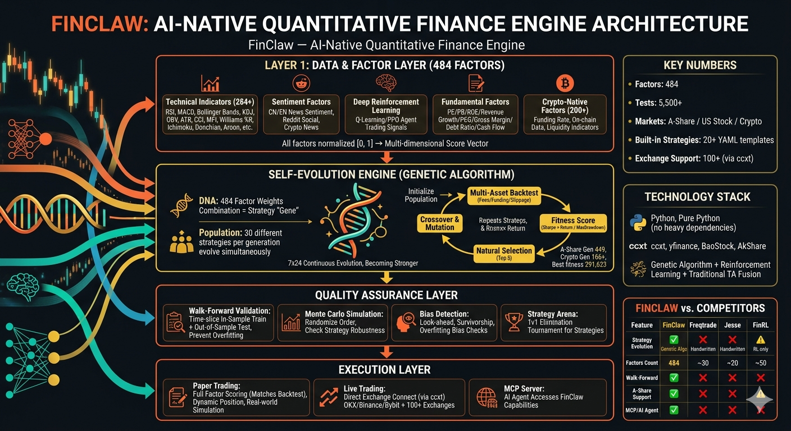

[English](README.md) | [??](README.zh-CN.md) | [???](README.ko.md) | [???](README.ja.md)

# FinClaw 🦀

**自己進化する投資インテリジェンス — 遺伝的アルゴリズムがあなたの想像を超える戦略を発見します。**

<p align="center">
  <a href="https://pypi.org/project/finclaw-ai/"></a>
  <a href="https://github.com/NeuZhou/finclaw/actions/workflows/ci.yml"></a>
  <a href="https://codecov.io/gh/NeuZhou/finclaw"></a>
  <a href="https://opensource.org/licenses/MIT"></a>
  <a href="https://www.python.org/"></a>
  
  
  
  <a href="https://github.com/NeuZhou/finclaw/stargazers"></a>
</p>

<p align="center">
  
</p>

<p align="center">
  <a href="https://www.youtube.com/watch?v=Y3wY9rj0PmE">
    
  </a>
  <br>
  <em>▶️ Watch: How FinClaw's Self-Evolving Engine Works (2 min)</em>
</p>

> FinClawは戦略の手動設計を必要としません。遺伝的アルゴリズムが484次元のファクター空間で**戦略を自律的に発見・進化**させ、Walk-Forward検証とモンテカルロ・シミュレーションで有効性を確認します。

## 免責事項

本プロジェクトは**教育・研究目的のみ**です。投資助言ではありません。過去のパフォーマンスは将来の結果を保証しません。必ず最初にペーパートレードで検証してください。

---

## 🚀 クイックスタート

```bash
pip install finclaw-ai
finclaw demo          # すべての機能を体験
finclaw quote AAPL    # リアルタイム相場
finclaw quote BTC/USDT # 暗号資産も対応
```

APIキーも取引所アカウントも設定ファイルも不要です。

---

<details>
<summary>📺 実行例を見る（クリックで展開）</summary>

```
$ finclaw demo

███████╗██╗███╗   ██╗ ██████╗██╗      █████╗ ██╗    ██╗
██╔════╝██║████╗  ██║██╔════╝██║     ██╔══██╗██║    ██║
█████╗  ██║██╔██╗ ██║██║     ██║     ███████║██║ █╗ ██║
██╔══╝  ██║██║╚██╗██║██║     ██║     ██╔══██║██║███╗██║
██║     ██║██║ ╚████║╚██████╗███████╗██║  ██║╚███╔███╔╝
╚═╝     ╚═╝╚═╝  ╚═══╝ ╚═════╝╚══════╝╚═╝  ╚═╝ ╚══╝╚══╝
AI-Powered Financial Intelligence Engine

🎬 FinClaw Demo — All features, zero config

━━━ 📊 Real-Time Quotes ━━━

Symbol        Price     Change        %                 Trend
────────────────────────────────────────────────────────────
AAPL                 189.84    +2.31  +1.23%  ▃▃▂ ▂▂▂▃▂ ▄▅▅▇█▇▃▄▄▃
NVDA                 875.28   +15.67  +1.82%    ▃▅▄▁▅▆▇█▄▅▆▇▄▄▄▄▅▄
TSLA                 175.21    -3.45  -1.93%  ▅▃▃▃▃▃▄▆▄▄▆▅▆▅▇█▅▃▂ 
MSFT                 415.50    +1.02  +0.25%  ▁▁▂▅▅▄▄▂▃▅▆▆▆▆▇▇▆▃  

━━━ 🚀 Backtest: Momentum Strategy on AAPL ━━━

Strategy:  +75.7%  (+32.5%/yr)    Buy&Hold:  +67.7%
Alpha:     +8.0%                  Sharpe:    1.85
MaxDD:     -8.3%                  Win Rate:  63%
```

</details>

---

## なぜ FinClaw なのか？

多くのクオンツツールは**あなた自身が**戦略を書く必要があります。FinClawは戦略を**あなたのために**進化させます。

| | FinClaw | Freqtrade | Jesse | FinRL / Qlib |
|---|---|---|---|---|
| 戦略設計 | GAが484次元DNAを進化 | ユーザーがルール記述 | ユーザーがルール記述 | DRLでエージェント訓練 |
| 継続的進化 | **戦略自体が進化し続ける** | ボット稼働、戦略固定 | ボット稼働、戦略固定 | 学習はオフライン |
| Walk-Forward検証 | ✅ 内蔵 (70/30 + モンテカルロ) | ❌ プラグイン必要 | ❌ プラグイン必要 | ⚠️ 部分的 |
| 過学習対策 | Arena競争 + バイアス検出 | 基本的なクロスバリデーション | 基本的 | ツールによる |
| APIキー不要 | ✅ `pip install && finclaw demo` | ❌ 取引所キー必要 | ❌ キー必要 | ❌ データセットアップ必要 |
| 対応市場 | 暗号資産 + A株 + 米国株 | 暗号資産のみ | 暗号資産のみ | A株 (Qlib) |
| MCPサーバー (AIエージェント) | ✅ Claude / Cursor / VS Code | ❌ | ❌ | ❌ |
| ファクターライブラリ | 484ファクター、自動重み付け | ~50個の手動指標 | 手動指標 | Alpha158 (Qlib) |

---

## 📊 484ファクター次元

284の汎用ファクター + 200の暗号資産固有ファクター、カテゴリ別に整理：

| カテゴリ | 数 | 例 |
|----------|-------|---------|
| 暗号資産固有 | 200 | ファンディングレートプロキシ、セッション効果、クジラ検出、連鎖清算 |
| モメンタム | 14 | ROC、加速度、トレンド強度、クオリティ・モメンタム |
| 出来高＆フロー | 13 | OBV、スマートマネー、出来高-価格乖離、Wyckoff VSA |
| ボラティリティ | 13 | ATR、ボリンジャー・スクイーズ、レジーム検出、ボラティリティのボラティリティ |
| 平均回帰 | 12 | Zスコア、ラバーバンド、ケルトナーポジション |
| トレンドフォロー | 14 | ADX、EMAゴールデンクロス、高値切り上げ・安値切り上げ、MAファン |
| Qlib Alpha158 | 11 | KMID、KSFT、CNTD、CORD、SUMP（Microsoft Qlib互換） |
| クオリティフィルター | 11 | 収益モメンタムプロキシ、相対力、レジリエンス |
| リスク警告 | 11 | 連続損失、デッドクロス、ギャップダウン、ストップ安 |
| 天井脱出 | 10 | ディストリビューション検出、クライマックス出来高、スマートマネー退出 |
| 価格構造 | 10 | ローソク足パターン、サポート/レジスタンス、ピボットポイント |
| Davis Double Play | 8 | 売上加速、テクノロジー・モート、供給枯渇 |
| ギャップ分析 | 8 | ギャップフィル、ギャップモメンタム、ギャップリバーサル |
| 市場幅 | 5 | 騰落指標、セクターローテーション、新高値/新安値 |
| ニュースセンチメント | 2 | EN/ZHキーワードセンチメントスコア + モメンタム |
| DRLシグナル | 2 | Q-learning買い確率 + 状態値推定 |

> **設計思想**: テクニカル、センチメント、DRL、ファンダメンタル — すべてのシグナルは`[0, 1]`を返すファクターとして統一表現されます。重み付けは進化エンジンが決定し、シグナル合成に人間のバイアスを持ち込みません。

---

## 🧬 自己進化エンジン

遺伝的アルゴリズムが最適な戦略を継続的に発見します：

1. **シード** — 多様なファクター重み構成で初期集団を生成
2. **評価** — Walk-Forward検証で各DNAをバックテスト
3. **選択** — 適応度（Sharpe × Return / MaxDrawdown）上位を保持
4. **変異** — ランダムな重み摂動、交配、ファクター追加/削除
5. **反復** — マシン上で7×24稼働

```bash
finclaw evolve --market crypto --generations 50   # 暗号資産（主要ユースケース）
finclaw evolve --market cn --generations 50       # A株
finclaw evolve --market crypto --population 50 --mutation-rate 0.2 --elite 10
```

### 進化結果

| 市場 | 世代 | 年間収益率 | シャープレシオ | 最大ドローダウン |
|--------|-----------|---------------|--------|-------------|
| A株 | 第89世代 | 2,756% | 6.56 | 26.5% |
| 暗号資産 | 第19世代 | 16,066% | 12.19 | 7.2% |

> ⚠️ これらは過去データでの**インサンプル**バックテスト結果です。実際のパフォーマンスは大幅に低くなります。Walk-Forwardアウトオブサンプル検証はデフォルトで有効です — `finclaw check-backtest`で結果を検証し、`finclaw paper`でペーパートレードしてから実資金を投入してください。

---

## 🏟️ Arenaモード（過学習対策）

従来のバックテストは各戦略を個別に評価するため、過学習した戦略がヒストリカルデータでは好成績でもライブでは失敗します。FinClawの**Arenaモード**がこの問題を解決します：

- 複数のDNA戦略が同一のシミュレーション市場で同時に取引
- **混雑ペナルティ**: 50%以上のDNA戦略が同じシグナルで買いに入ると、プライスインパクトが発動
- 孤立環境でしか機能しない過学習戦略はArenaランキングでペナルティを受ける

---

## ✅ 品質保証

- Walk-Forward検証（70/30 学習/テスト分割）
- モンテカルロ・シミュレーション（1,000回反復、p値 < 0.05）
- ブートストラップ95%信頼区間
- Arena競争（マルチDNA市場シミュレーション）
- バイアス検出（先読み、スヌーピング、生存者）
- ファクターIC/IR分析と減衰曲線
- ファクター直交行列（冗長ファクターの自動除去）
- 適合度関数における売買回転率ペナルティ
- 5,600以上の自動テスト

---

## 💻 CLIリファレンス

FinClawは70以上のサブコマンドを搭載しています。主要なものを紹介します：

| コマンド | 説明 |
|---------|-------------|
| `finclaw demo` | 全機能をデモ |
| `finclaw quote AAPL` | リアルタイム米国株相場 |
| `finclaw quote BTC/USDT` | 暗号資産相場（ccxt経由） |
| `finclaw evolve --market crypto` | 遺伝的アルゴリズム進化を実行 |
| `finclaw backtest -t AAPL` | 株式で戦略バックテスト |
| `finclaw check-backtest` | バックテスト結果を検証 |
| `finclaw analyze TSLA` | テクニカル分析 |
| `finclaw screen` | 銘柄スクリーニング |
| `finclaw risk-report` | ポートフォリオリスクレポート |
| `finclaw sentiment` | 市場センチメント |
| `finclaw copilot` | AI金融アシスタント |
| `finclaw generate-strategy` | 自然言語 → 戦略コード |
| `finclaw mcp serve` | AIエージェント向けMCPサーバー |
| `finclaw paper` | ペーパートレードモード |
| `finclaw doctor` | 環境チェック |

全コマンド一覧は `finclaw --help` で確認できます。

---

## 🤖 MCPサーバー（AIエージェント向け）

FinClawをClaude、Cursor、VS Code、その他MCP対応クライアント向けのツールとして公開：

```json
{
  "mcpServers": {
    "finclaw": {
      "command": "finclaw",
      "args": ["mcp", "serve"]
    }
  }
}
```

10種類のツールを提供: `get_quote`、`get_history`、`list_exchanges`、`run_backtest`、`analyze_portfolio`、`get_indicators`、`screen_stocks`、`get_sentiment`、`compare_strategies`、`get_funding_rates`。

---

## 📡 データソース

| 市場 | ソース | APIキーは必要？ |
|--------|--------|-----------------|
| 暗号資産 | ccxt（100以上の取引所） | 不要（公開データ） |
| 米国株 | Yahoo Finance | 不要 |
| A株 | AKShare + BaoStock | 不要 |
| ニュースセンチメント | CryptoCompare + AKShare | 不要 |

---

## アーキテクチャ

```
┌──────────────────────────────────────────────────────┐
│             Evolution Engine (Core)                   │
│      Genetic Algorithm → Mutate → Backtest → Select   │
│                                                       │
│      Input: 484 factors × weights = DNA               │
│      Output: Walk-forward validated strategy           │
├──────────────────────────────────────────────────────┤
│   Technical(284) │ Sentiment │ DRL │ Davis │ Crypto(200)│
│       All → compute() → [0, 1]                        │
├──────────────────────────────────────────────────────┤
│   Arena Competition │ Bias Detection │ Monte Carlo     │
├──────────────────────────────────────────────────────┤
│   Paper Trading → Live Trading → 100+ Exchanges       │
└──────────────────────────────────────────────────────┘
```

---

## ロードマップ

- [x] 484ファクター進化エンジン
- [x] Walk-Forward検証 + モンテカルロ
- [x] Arena競争モード
- [x] バイアス検出スイート
- [x] ニュースセンチメント + DRLファクター
- [x] Davis Double Playファクター
- [x] ペーパートレード基盤
- [x] AIエージェント向けMCPサーバー
- [ ] DEX執行（Uniswap V3 / Arbitrum）
- [ ] マルチタイムフレーム対応（1h/4h/1d）
- [ ] 価格系列向けファウンデーションモデル

---

## 🌐 エコシステム

FinClawはNeuZhou AIエージェントツールキットの一部です：

| プロジェクト | 説明 |
|---------|-------------|
| **[FinClaw](https://github.com/NeuZhou/finclaw)** | AI native 量的金融エンジン |
| **[ClawGuard](https://github.com/NeuZhou/clawguard)** | AIエージェント免疫システム — 285以上の脅威パターン、ゼロ依存 |
| **[AgentProbe](https://github.com/NeuZhou/agentprobe)** | AIエージェント向けPlaywright — テスト、記録、リプレイ |

---

## コントリビューション

```bash
git clone https://github.com/NeuZhou/finclaw.git
cd finclaw && pip install -e ".[dev]" && pytest
```

ガイドラインは[CONTRIBUTING.md](CONTRIBUTING.md)をご覧ください。[バグ報告](https://github.com/NeuZhou/finclaw/issues) · [機能リクエスト](https://github.com/NeuZhou/finclaw/issues)

---

## ライセンス

[MIT](LICENSE)

---

## Star History

<a href="https://www.star-history.com/#NeuZhou/finclaw&Date">
  <picture>
    <source media="(prefers-color-scheme: dark)" srcset="https://api.star-history.com/svg?repos=NeuZhou/finclaw&type=Date&theme=dark" />
    
  </picture>
</a>
