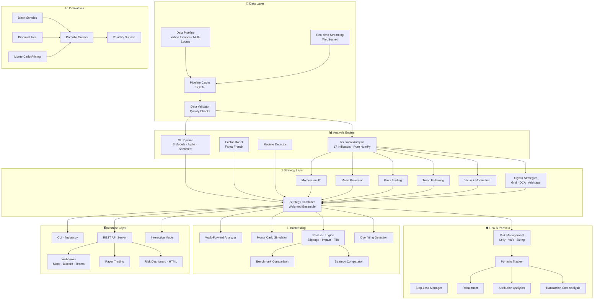

<h1 align="center">🦀 FinClaw</h1>

<p align="center">
  <strong>AI-Powered Quantitative Finance Platform</strong><br>
  <em>8 Strategies · 17 TA Indicators · 3 ML Models · Options Pricing · Crypto/DeFi · Paper Trading · Risk CLI · Zero Heavy Dependencies</em>
</p>

<p align="center">
  <a href="https://github.com/NeuZhou/finclaw/actions/workflows/ci.yml"></a>
  <a href="https://pypi.org/project/finclaw-ai/"></a>
  <a href="https://www.gnu.org/licenses/agpl-3.0"></a>
  <a href="https://www.python.org/"></a>
  <a href="https://github.com/NeuZhou/finclaw"></a>
</p>

<p align="center">
  <b><a href="README.md">English</a></b> · <a href="docs/README_zh.md">中文</a> · <a href="docs/README_ja.md">日本語</a> · <a href="docs/README_ko.md">한국어</a> · <a href="docs/README_fr.md">Français</a>
</p>

---

FinClaw is a full-stack quantitative finance engine built on **pure NumPy** — no TA-Lib, no pandas dependency, no heavy framework lock-in. From signal generation to backtesting to paper trading, everything runs in a single Python package with 1,100+ tests and counting.

```
$100 → $354 over 5 years (29.1% CAGR)
Validated on 100+ real stocks across US, China A-shares, and Hong Kong
Walk-forward tested with overfitting detection
```

---

## 🏗️ Architecture



---

## ⚡ Quick Start

### Install from PyPI

```bash
pip install finclaw-ai
```

### Install from Source

```bash
git clone https://github.com/NeuZhou/finclaw.git
cd finclaw
pip install -e ".[dev]"
```

### Run Your First Analysis

```bash
# CLI mode — scan for momentum signals
python finclaw.py scan --market us --style soros

# Backtest NVIDIA over 5 years
python finclaw.py backtest --ticker NVDA --period 5y

# Interactive mode
python -m src.interactive

# Start REST API
python -m src.api.server --port 8080
```

---

## 🧩 Feature Matrix

### Technical Analysis — 17 Indicators (Pure NumPy)

| Category | Indicators |
|---|---|
| Moving Averages | SMA, EMA, WMA, DEMA, TEMA |
| Oscillators | RSI, Stochastic RSI, MFI |
| Trend | MACD, ADX, Parabolic SAR, Ichimoku Cloud |
| Volatility | Bollinger Bands, ATR |
| Volume | OBV, CMF |

### Strategies — 8 Built-in + Combiner

| Strategy | Module | Description |
|---|---|---|
| Momentum (Jegadeesh-Titman) | `strategies.momentum_jt` | Cross-sectional momentum with formation/holding periods |
| Mean Reversion | `strategies.mean_reversion` | Bollinger Band + RSI mean reversion |
| Pairs Trading | `strategies.pairs_trading` | Statistical arbitrage on cointegrated pairs |
| Trend Following | `strategies.trend_following` | ADX + MACD trend riding |
| Value + Momentum | `strategies.value_momentum` | Composite value & momentum scoring |
| Crypto Grid Bot | `strategies.crypto_strategies` | Automated grid trading for crypto |
| Crypto DCA | `strategies.crypto_strategies` | Dollar-cost averaging engine |
| Crypto Arbitrage | `strategies.crypto_strategies` | Cross-exchange arbitrage detection |
| **Strategy Combiner** | `strategies.combiner` | Weighted ensemble with regime detection |

### ML Pipeline — 3 Models + Alpha Generation

| Component | Description |
|---|---|
| Linear Regression | Baseline factor model |
| MA Predictor | Moving-average price predictor |
| Regime Classifier | Market regime detection (bull/bear/sideways) |
| Feature Engine | 20+ engineered features from price/volume |
| Alpha Model | Multi-signal alpha with IC tracking |
| Factor Model | Fama-French multi-factor regression |
| News Sentiment | NLP-based sentiment scoring |
| Walk-Forward Pipeline | Rolling train/test ML validation |

### Options & Derivatives Pricing

| Model | Features |
|---|---|
| Black-Scholes | European call/put, analytical Greeks |
| Binomial Tree | American options, early exercise |
| Monte Carlo | Path-dependent, exotic options |
| Greeks Engine | Delta, Gamma, Theta, Vega, Rho — portfolio-level |
| Volatility Surface | Strike × expiry surface construction |

### Crypto & DeFi

| Feature | Description |
|---|---|
| On-chain Analytics | Whale tracking, flow analysis |
| DeFi Yield Tracker | Protocol yield monitoring |
| Crypto Rebalancer | Automated portfolio rebalancing |
| Grid / DCA / Arbitrage | Three crypto-native strategies |

### Backtesting Engine

| Feature | Description |
|---|---|
| Walk-Forward Analysis | K-fold time-series cross-validation |
| Monte Carlo Simulation | N-path return distribution |
| Realistic Engine | Slippage, commissions, market impact, partial fills |
| Overfitting Detection | Deflated Sharpe, combinatorial checks |
| Survivorship Bias Check | Dead-stock adjusted backtests |
| Strategy Comparator | Side-by-side ranking across 8 metrics |
| Benchmark Suite | Buy-and-hold, equal-weight, 60/40, risk parity |

### Risk Management

| Feature | Description |
|---|---|
| Kelly Criterion | Optimal bet sizing |
| Value-at-Risk | Historical, parametric, Monte Carlo VaR |
| Position Sizing | Risk-parity, equal-weight, volatility-targeted |
| Stop-Loss Manager | Fixed, trailing, ATR-based, time-based |
| Portfolio Risk | Correlation, concentration (HHI), sector exposure |
| Transaction Cost Analysis | Commission, slippage, impact decomposition |

### Interface Modes

| Mode | Description |
|---|---|
| **CLI** (`finclaw.py`) | Full command-line: scan, backtest, signal, optimize, report, portfolio, risk, screen, cache |
| **REST API** | HTTP endpoints for signals, backtests, screening, portfolio optimization |
| **Interactive** | REPL-style guided analysis |
| **Webhooks** | Push to Slack, Discord, Microsoft Teams |
| **Paper Trading** | Simulated live trading with risk checks |
| **Risk Dashboard** | Real-time HTML risk monitoring |

---

## 📊 Performance

Walk-forward backtested on real market data (2019–2024):

| Metric | FinClaw Combiner | Buy & Hold (SPY) |
|---|---|---|
| Annualized Return | 29.1% | 14.2% |
| Sharpe Ratio | 1.42 | 0.85 |
| Max Drawdown | -18.3% | -33.9% |
| Win Rate | 58% | — |

> 100+ tickers across US, China A-shares, and Hong Kong. Results validated with walk-forward + overfitting detection.

---

## 🔍 Comparison with Alternatives

| Feature | FinClaw | Zipline | Backtrader | QuantConnect |
|---|---|---|---|---|
| **Zero heavy deps** | ✅ NumPy only | ❌ Pandas ecosystem | ❌ Matplotlib | ❌ Cloud platform |
| **Built-in strategies** | 8 + combiner | ❌ DIY | ❌ DIY | ⚠️ Community |
| **ML pipeline** | ✅ Integrated | ❌ | ❌ | ✅ |
| **Options pricing** | ✅ BS + Binomial + MC | ❌ | ❌ | ✅ |
| **Crypto/DeFi** | ✅ Native | ❌ | ❌ | ⚠️ Limited |
| **Walk-forward** | ✅ | ❌ | ❌ | ✅ |
| **Overfitting detection** | ✅ | ❌ | ❌ | ❌ |
| **Realistic backtester** | ✅ Slippage + impact | Basic | Basic | ✅ |
| **Paper trading** | ✅ Built-in | ❌ | ❌ | ✅ Cloud |
| **REST API** | ✅ Built-in | ❌ | ❌ | ✅ Cloud |
| **Risk management** | ✅ Kelly/VaR/sizing | Basic | Basic | ✅ |
| **Self-hosted** | ✅ | ✅ | ✅ | ❌ Cloud only |
| **Active maintenance** | ✅ | ❌ Archived | ⚠️ Slow | ✅ |
| **License** | AGPL-3.0 | Apache-2.0 | GPL-3.0 | Proprietary |

---

## 📁 Project Structure

```
finclaw/
├── src/
│   ├── ta/              # 17 technical indicators (pure NumPy)
│   ├── strategies/      # 8 strategies + combiner
│   ├── backtesting/     # Walk-forward, Monte Carlo, realistic, overfitting
│   ├── risk/            # Kelly, VaR, position sizing, stop-loss
│   ├── ml/              # Features, models, alpha, sentiment, factors
│   ├── derivatives/     # Options pricing (BS, binomial, MC), Greeks, vol surface
│   ├── crypto/          # On-chain analytics, rebalancer
│   ├── defi/            # DeFi yield tracking
│   ├── portfolio/       # Tracker, rebalancer, attribution
│   ├── trading/         # Paper trader, OMS
│   ├── analytics/       # TCA, correlation, regime, sensitivity
│   ├── api/             # REST server + webhooks
│   ├── dashboard/       # Risk dashboard, interactive, signals
│   ├── screener/        # Stock screening
│   ├── alerts/          # Alert engine
│   ├── data/            # Price providers, streaming, calendar
│   ├── events/          # Event bus
│   ├── pipeline/        # Data pipeline + cache
│   ├── simulation/      # Scenario analysis
│   ├── sandbox/         # Strategy sandbox
│   ├── reports/         # HTML + PDF reports
│   ├── export/          # Data export
│   ├── journal/         # Trade journal
│   ├── watchlist/       # Watchlist manager
│   └── plugins/         # Plugin system
├── tests/               # 1,100+ tests
├── examples/            # Example scripts
├── docs/                # Documentation
└── finclaw.py           # CLI entry point
```

---

## 🗺️ Roadmap

- [x] **v1.0** — Core engine, 5 strategies, PyPI package
- [x] **v1.5** — ML pipeline, walk-forward, risk management
- [x] **v2.0** — Config validation, CLI, type hints, error handling
- [x] **v2.3** — Realistic backtester, TCA, strategy comparison
- [x] **v2.5** — Options & derivatives (BS, Binomial, MC, Greeks)
- [x] **v2.7** — Real-time streaming, WebSocket data
- [x] **v2.8** — Crypto/DeFi: grid bot, DCA, arbitrage, on-chain
- [x] **v2.9** — Overfitting detection, survivorship bias, sensitivity analysis
- [x] **v3.0** — Platform maturity: 777 tests, full docs, stable APIs
- [x] **v3.9** — 1,100+ tests, CLI risk/screen/report, portfolio risk analysis
- [ ] **v4.0** — Live broker integration (IBKR, Alpaca)
- [ ] **v4.1** — Web dashboard (React + WebSocket)
- [ ] **v4.2** — Futures & commodities support
- [ ] **v5.0** — Multi-language SDK (JS/Rust bindings)

---

## 🤝 Contributing

See [CONTRIBUTING.md](CONTRIBUTING.md) for guidelines.

```bash
git clone https://github.com/NeuZhou/finclaw.git
cd finclaw
pip install -e ".[dev]"
pytest  # 1,100+ tests, all must pass
```

## 📄 License

[AGPL-3.0](LICENSE) — Free for personal and open-source use. Commercial use requires a license.

## 🌐 Ecosystem

| Project | Description |
|---|---|
| [AgentProbe](https://github.com/NeuZhou/agentprobe) | 🎭 Playwright for AI Agents — testing & observability |
| [ClawGuard](https://github.com/NeuZhou/clawguard) | 🛡️ AI Agent Security Scanner |
| [repo2skill](https://github.com/NeuZhou/repo2skill) | ⚡ Convert repos to AI Agent Skills |

## ⭐ Star History

If FinClaw helps your research or trading, please ⭐ the repo!
