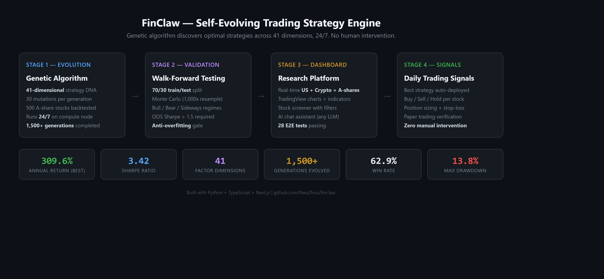
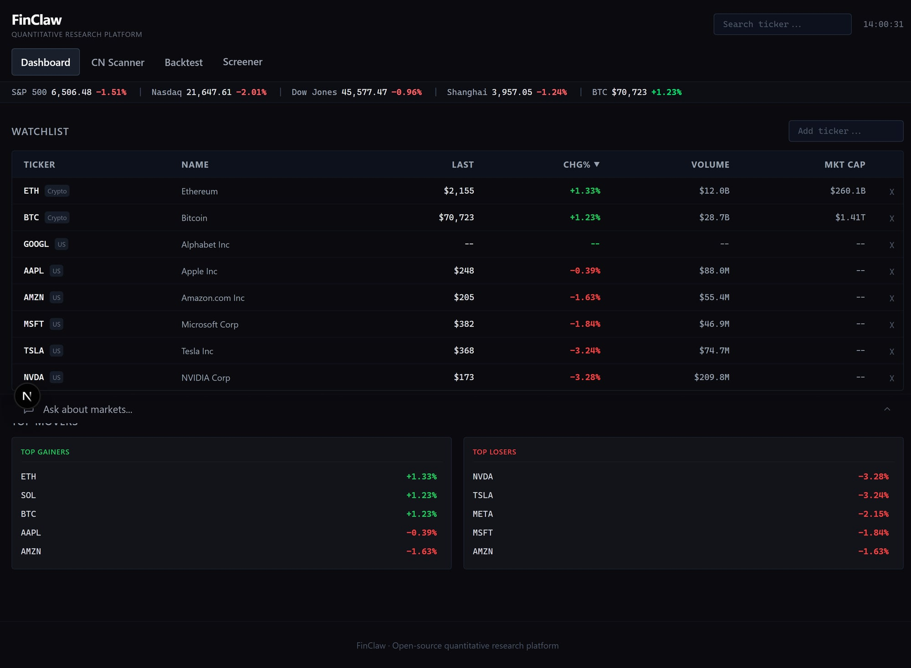

# FinClaw 🦀

**Self-Evolving Trading Intelligence. 484 factors. 33 categories. 24/7 autonomous evolution.**

<p align="center">
  <a href="https://pypi.org/project/finclaw-ai/"></a>
  <a href="https://github.com/NeuZhou/finclaw/actions/workflows/ci.yml"></a>
  <a href="https://opensource.org/licenses/MIT"></a>
  <a href="https://www.python.org/"></a>
  
  
  
  
  
  <a href="https://github.com/NeuZhou/finclaw/stargazers"></a>
</p>



> FinClaw doesn't need you to write strategies — its genetic algorithm **discovers and evolves them autonomously** across 484 factor dimensions, incorporating technical analysis, news sentiment, deep reinforcement learning, and industrial logic.

## Disclaimer

This project is for **educational and research purposes only**. Not financial advice. Past performance does not guarantee future results.

## Table of Contents

- [Why FinClaw?](#why-finclaw)
- [Quick Start](#quick-start)
- [What Makes FinClaw Different?](#what-makes-finclaw-different)
- [Architecture](#architecture)
- [Supported Exchanges](#supported-exchanges)
- [Factor Library (484 dimensions)](#factor-library-484-dimensions)
- [Evolution Engine](#evolution-engine)
- [Arena Mode (Anti-Overfitting)](#arena-mode-anti-overfitting)
- [Backtest Bias Detection](#backtest-bias-detection)
- [Validation & Quality](#validation--quality)
- [Dashboard](#dashboard)
- [MCP Server](#mcp-server-for-ai-agents)
- [Data Sources](#data-sources)
- [Contributing](#contributing)
- [License](#license)

## Why FinClaw?

- **Self-evolving strategies** — Genetic algorithm discovers optimal trading DNA 24/7
- **484-dimensional factor space** — Technical, fundamental, sentiment, DRL, and crypto-specific factors
- **Arena competition** — Multiple DNA strategies compete in the same market to eliminate overfitting
- **Bias detection** — Automatic lookahead, data snooping, and survivorship bias checks
- **News sentiment** — Keyword-based sentiment analysis (EN/ZH) integrated as evolution factors
- **Deep RL signals** — Q-learning agent provides buy probability as a factor for evolution
- **Walk-forward validated** — 70/30 train/test + Monte Carlo simulation
- **Multi-market** — Crypto (primary), A-shares, US stocks
- **Live trading ready** — Dry-run and live modes via ccxt (Binance, OKX, Bybit, etc.)
- **Zero config start** — `pip install finclaw-ai && finclaw demo`

## Quick Start

### Evolve Your First Crypto Strategy

```bash
pip install finclaw-ai

# Download Top 20 crypto data
finclaw download-crypto

# Start 24/7 evolution
finclaw evolve --market crypto --data-dir data/crypto --generations 999999

# Validate with bias detection
python -m src.evolution.bias_cli --all

# Run paper trading (dry-run mode, safe)
python scripts/start_paper_trading.py --exchange okx --balance 10000
```

### CLI Basics

```bash
finclaw demo             # See all features — zero API keys
finclaw quote BTC/USDT   # Real-time crypto quote
finclaw quote AAPL       # Works for stocks too
```

### Dashboard

```bash
git clone https://github.com/NeuZhou/finclaw.git
cd finclaw/dashboard
npm install && npm run dev
# Open http://localhost:3000
```

For a detailed crypto walkthrough, see [Crypto Trading: Getting Started](docs/crypto-trading/getting-started.md).

## What Makes FinClaw Different?

FinClaw is not a trading bot — it's a **Self-Evolving Trading Intelligence**. The strategy isn't written by humans; it *grows*.

| Feature | Freqtrade / FinRL | FinClaw |
|---------|-------------------|---------|
| Strategy Design | Human writes rules / DRL trains agent | GA evolves 484-dim DNA autonomously |
| Factor Library | Manual indicators (~50) | 484 factors across 33 categories |
| Signal Sources | Technical only | Technical + Sentiment + DRL + Industrial logic |
| Anti-Overfitting | Basic cross-validation | Arena competition + bias detection |
| Factor Discovery | Manual | LLM-assisted auto-generation |
| Runs 24/7 | Bot runs, strategy static | **Strategy itself evolves 24/7** |
| Market Coverage | Usually single market | Crypto + A-shares + US stocks |

## Architecture

```
┌─────────────────────────────────────────────────────┐
│            Evolution Engine (Core)                   │
│     Genetic Algorithm → Mutate → Backtest → Select   │
│                                                      │
│     Input: 484 factors × weights = DNA               │
│     Output: Optimal trading strategy                  │
├─────────────────────────────────────────────────────┤
│                Factor Sources                        │
│  ┌──────────┐ ┌──────────┐ ┌──────────┐ ┌────────┐ │
│  │Technical │ │Sentiment │ │   DRL    │ │ Davis  │ │
│  │  280+    │ │  News    │ │Q-learning│ │Double  │ │
│  │ factors  │ │ EN / ZH  │ │ signals  │ │ Play   │ │
│  └────┬─────┘ └────┬─────┘ └────┬─────┘ └───┬────┘ │
│       │             │            │            │      │
│       └─────────────┴────────────┴────────────┘      │
│                  All → compute() → [0, 1]            │
├─────────────────────────────────────────────────────┤
│              Quality Assurance                       │
│  ┌────────────┐ ┌─────────────┐ ┌────────────────┐  │
│  │   Arena    │ │    Bias     │ │   IC/IR/Decay  │  │
│  │Competition │ │  Detection  │ │   Analysis     │  │
│  └────────────┘ └─────────────┘ └────────────────┘  │
├─────────────────────────────────────────────────────┤
│              Execution Layer                         │
│  Paper Trading → Live Trading → 100+ Exchanges       │
└─────────────────────────────────────────────────────┘
```

## Supported Exchanges

Via [ccxt](https://github.com/ccxt/ccxt): **Binance**, **OKX**, **Bybit**, Gate.io, Kraken, Coinbase, KuCoin, Bitget, HTX, and **100+ more**.

```bash
# List all supported exchanges
finclaw list-exchanges

# Use a specific exchange
finclaw evolve --market crypto --exchange okx
```

## Factor Library (484 dimensions)

The largest open-source trading factor library, organized into 33 categories:

| Category | Count | Description |
|----------|-------|-------------|
| Crypto-Specific | 200 | Funding rate proxy, session effects, whale detection, liquidation cascade |
| Momentum | 14 | ROC, acceleration, trend strength, quality momentum |
| Volume & Flow | 13 | OBV, smart money, volume-price divergence, Wyckoff VSA |
| Volatility | 13 | ATR, Bollinger squeeze, regime detection, vol-of-vol |
| Mean Reversion | 12 | Z-score, rubber band, Keltner position |
| Price Structure | 10 | Candlestick patterns, support/resistance, pivot points |
| Qlib Alpha158 | 11 | KMID, KSFT, CNTD, CORD, SUMP (Microsoft Qlib compatible) |
| Quality Filter | 10 | Earnings momentum proxy, relative strength, resilience |
| Risk Warning | 10 | Consecutive losses, death cross, gap-down, limit-down |
| Top Escape | 10 | Distribution detection, climax volume, smart money exit |
| Trend Following | 10 | ADX, EMA golden cross, higher-highs-lows, MA fan |
| Market Breadth | 5 | Advance-decline, sector rotation, new highs/lows |
| **Davis Double Play** 🆕 | 8 | Revenue acceleration, tech moat, supply exhaustion, 量价齐升 |
| **News Sentiment** 🆕 | 2 | EN/ZH keyword sentiment score + 7-day momentum |
| **DRL Signals** 🆕 | 2 | Q-learning buy probability + state value estimate |
| Fundamental Proxy | 10 | PE, PB, institutional buying, earnings surprise |
| Pullback Strategy | 5 | Healthy retracement, RSI divergence in uptrend |
| Bottom Confirmation | 5 | Long lower shadow, volume exhaustion, reversal candle |
| ... and 15 more categories | 134 | Alpha101, gap analysis, microstructure, etc. |

> **Design principle**: Every signal source — technical, sentiment, DRL, fundamental — is expressed as a factor returning `[0, 1]`. The evolution engine decides the weight. No human bias in signal mixing.

### Factor Quality Analysis

- **IC/IR scoring** — Information Coefficient and Information Ratio for every factor
- **Decay analysis** — How quickly factor signal degrades over time
- **Tier classification** — Factors ranked by predictive power (S/A/B/C tiers)
- **Correlation matrix** — NxN orthogonality detection with auto-pruning
- **Qlib Alpha158 coverage** — Gap analysis ensuring comprehensive factor coverage ([details](docs/factor_gap_analysis.md))

## Evolution Engine

FinClaw uses a genetic algorithm to continuously discover optimal trading strategies:

1. **Seed** — Initialize population with diverse factor weight configurations
2. **Evaluate** — Backtest each DNA on historical data with walk-forward validation
3. **Select** — Keep the top performers in the frontier
4. **Mutate** — Random weight perturbations, crossover, factor addition/removal
5. **Repeat** — 24/7 on your compute node

```bash
# Evolve on crypto (primary use case)
finclaw evolve --market crypto --data-dir data/crypto --generations 999999

# Also works on A-shares
finclaw evolve --market cn --data-dir data/a_shares --generations 999999

# US stocks
finclaw evolve --market us --data-dir data/us_stocks --generations 999999
```

### Evolution Results (Real runs)

| Market | Generation | Annual Return | Sharpe | Max Drawdown | Trades |
|--------|-----------|---------------|--------|-------------|--------|
| A-Shares | Gen 89 | 2,756% | 6.56 | 26.5% | 656 |
| Crypto | Gen 19 | 16,066% | 12.19 | 7.2% | 8,357 |

> ⚠️ These are backtest results. Real-world performance will differ. Always paper trade first.

## Arena Mode (Anti-Overfitting)

Traditional backtesting evaluates each strategy in isolation — overfitted strategies can score well on historical data but fail live. FinClaw's **Arena Mode** (inspired by [FinEvo](https://arxiv.org)) solves this:

```
┌──────────────────────────────────────────┐
│         Arena: Shared Market Sim          │
│                                           │
│   DNA-1 ──┐                              │
│   DNA-2 ──┤── Same OHLCV data            │
│   DNA-3 ──┤── Same initial capital        │
│   DNA-4 ──┤── Price impact when crowded   │
│   DNA-5 ──┘── Ranked by final P&L        │
│                                           │
│   Overfitted DNA → poor rank → penalized  │
└──────────────────────────────────────────┘
```

- Multiple DNA strategies trade simultaneously in the same simulated market
- **Price impact**: When >50% of DNA strategies buy at the same time, price shifts up (crowding penalty)
- Arena rank adjusts fitness scores — overfitted strategies that only work in isolation get penalized
- Runs every N generations alongside standard evaluation

```bash
# Run evolution with arena mode
python -m src.evolution.arena_evolver --generations 100 --arena-every 5
```

## Backtest Bias Detection

Automatically detect common backtesting pitfalls before trusting results:

```bash
# Check all factors for look-ahead bias
python -m src.evolution.bias_cli --factors

# Check a DNA for overfitting
python -m src.evolution.bias_cli --dna evolution_results/best_ever.json

# Run all checks
python -m src.evolution.bias_cli --all
```

| Check | What it catches |
|-------|----------------|
| **Look-ahead bias** | Factors that accidentally peek at future data |
| **Data snooping** | DNA that performs 3x+ better on train vs test (overfit) |
| **Survivorship bias** | Stocks that delisted during the backtest period |

## Validation & Quality

- Walk-forward validation (70/30 split)
- Monte Carlo simulation (1000 iterations, p-value < 0.05)
- Bootstrap 95% confidence intervals
- Arena competition (multi-DNA market simulation)
- Bias detection (lookahead, snooping, survivorship)
- Factor IC/IR analysis with decay curves
- Factor orthogonality matrix (auto-prune redundant factors)
- Turnover penalty in fitness function
- Anti-look-ahead bias verified (32 E2E tests)
- 5000+ automated tests

## Dashboard



- Real-time prices (Crypto, US stocks, A-Shares)
- TradingView professional charts
- Crypto portfolio tracker with live P&L
- Stock screener with filters + CSV export
- AI chat assistant (OpenAI, Anthropic, DeepSeek, Ollama)
- E2E tested with Playwright (28 tests)

## MCP Server (for AI Agents)

Expose FinClaw as tools for Claude, Cursor, VS Code, or any MCP-compatible client:

```json
{
  "mcpServers": {
    "finclaw": {
      "command": "finclaw",
      "args": ["mcp", "serve"]
    }
  }
}
```

10 tools available: `get_quote`, `get_history`, `list_exchanges`, `run_backtest`, `analyze_portfolio`, `get_indicators`, `screen_stocks`, `get_sentiment`, `compare_strategies`, `get_funding_rates`.

## Data Sources

| Market | Source | Coverage |
|--------|--------|----------|
| Cryptocurrency | ccxt (100+ exchanges) | BTC, ETH, SOL, and 10,000+ pairs |
| US Stocks | Yahoo Finance | All NYSE/NASDAQ |
| China A-Shares | AKShare + BaoStock | All SSE/SZSE stocks |
| News Sentiment | CryptoCompare + AKShare | Crypto news (EN) + A-share news (ZH) |
| Indices | Yahoo Finance + Sina | S&P 500, Nasdaq, Shanghai Composite |

No API keys required for basic market data.

## Roadmap

- [x] 484-factor evolution engine
- [x] Arena competition mode
- [x] Bias detection suite
- [x] News sentiment factors
- [x] DRL Q-learning factors
- [x] Davis Double Play factors (industrial logic)
- [x] Paper trading infrastructure
- [ ] DEX execution (Uniswap V3 / Arbitrum)
- [ ] Multi-timeframe support (1h/4h/1d)
- [ ] Crypto trading dashboard page
- [ ] Foundation model for price sequences

## Contributing

```bash
git clone https://github.com/NeuZhou/finclaw.git
cd finclaw && pip install -e ".[dev]"
pytest
```

See [CONTRIBUTING.md](CONTRIBUTING.md) for guidelines.

## Limitations

FinClaw is a research and education tool. Key limitations:

- **Free data sources** — subject to delays, gaps, and API rate limits
- **Simplified backtesting** — does not model order book depth, partial fills, or market microstructure
- **Historical bias** — backtested strategies may not perform similarly in live markets
- **Dry-run first** — always validate strategies with paper trading before risking real capital

For production trading, combine with proper risk management and position sizing.

## License

[MIT](LICENSE)

## Star History

<a href="https://www.star-history.com/#NeuZhou/finclaw&Date">
  <picture>
    <source media="(prefers-color-scheme: dark)" srcset="https://api.star-history.com/svg?repos=NeuZhou/finclaw&type=Date&theme=dark" />
    
  </picture>
</a>
