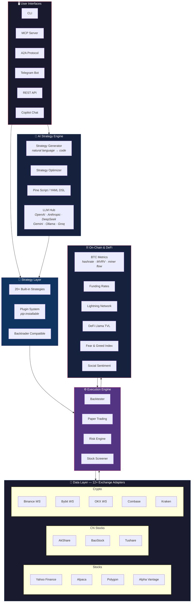
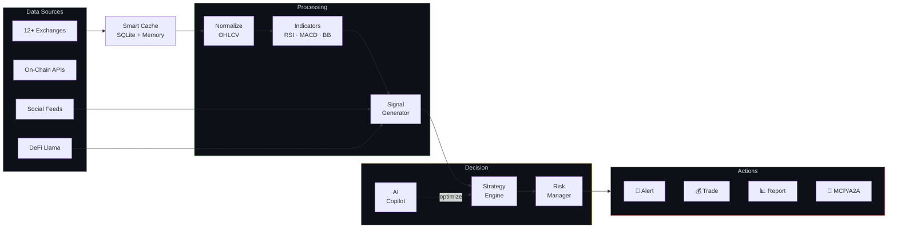

<h1 align="center">🦀 FinClaw</h1>

<p align="center">
  <strong>AI-powered quantitative finance in your terminal</strong>
</p>

<p align="center">
  <a href="https://pypi.org/project/finclaw-ai/"></a>
  <a href="https://github.com/NeuZhou/finclaw/actions/workflows/ci.yml"></a>
  <a href="https://opensource.org/licenses/MIT"></a>
  <a href="https://www.python.org/"></a>
  <a href="https://github.com/NeuZhou/finclaw/stargazers"></a>
</p>

<p align="center">
  
</p>

```bash
$ finclaw quote BTC-USDT
  ₿ BTC-USDT  $67,342.50  +1,285.30 +1.95%  ▲
  ┌─────────────────────────────────────────────┐
  │  Bid: 67,340.20   Ask: 67,344.80           │
  │  24h Vol: 28,451 BTC ($1.92B)              │
  │  24h High: 68,100.00   Low: 65,820.40     │
  │  Funding: +0.0103%   Open Interest: $18.2B │
  └─────────────────────────────────────────────┘

$ finclaw backtest momentum --symbol NVDA --start 2023-01-01
  🚀 Backtest Results: NVDA | momentum
  ════════════════════════════════════════════════
  Period        2023-01-01 → 2024-12-31 (504 days)
  Total Return  +142.3% (+55.2%/yr)
  Alpha         +18.7% vs SPY
  Max Drawdown  -12.1%
  Sharpe Ratio  1.85
  Win Rate      63.8%  (30/47 trades)
  Profit Factor 2.41
  ────────────────────────────────────────────────
  Equity Curve:
  68k │                                    ╭───
  54k │                         ╭──────────╯
  41k │              ╭──────────╯
  27k │    ╭─────────╯
  14k │────╯
      └───────────────────────────────────────→

$ finclaw defi-tvl --top 10
  📊 DeFi Total Value Locked — Top 10 Protocols
  ═══════════════════════════════════════════════
  #   Protocol        Chain       TVL          Δ 7d
  ─── ─────────────── ─────────── ──────────── ──────
  1   Lido            Ethereum    $33.2B       +2.1%
  2   AAVE            Multi       $22.8B       +4.5%
  3   EigenLayer      Ethereum    $15.1B       -1.2%
  4   Maker           Ethereum    $8.7B        +0.8%
  5   Uniswap         Multi       $6.2B        +3.3%
  6   Rocket Pool     Ethereum    $4.9B        +1.7%
  7   Pendle          Multi       $4.5B        +12.4%
  8   Ethena          Ethereum    $3.8B        +8.9%
  9   Morpho          Ethereum    $3.2B        +5.1%
  10  Compound        Multi       $2.9B        -0.3%
  ─── ─────────────── ─────────── ──────────── ──────
       Total DeFi TVL             $180.5B      +2.8%

$ finclaw sentiment TSLA
  🧠 Sentiment Analysis: TSLA
  ═══════════════════════════════
  Overall Score   0.72 BULLISH  ██████████░░░░
  News Sentiment  0.65          ████████░░░░░░
  Social Buzz     0.81          ██████████░░░░
  Insider Flow    0.58 NEUTRAL  ███████░░░░░░░
  Sources: 142 articles, 2.4k social mentions (24h)
```

---

## Why FinClaw?

Most quant tools make you configure databases, install heavy dependencies, and write boilerplate before you see your first result. **FinClaw gets you from zero to insight in one command.** Zero API keys needed — it uses Yahoo Finance by default. A pure NumPy core means it installs in seconds, not minutes. And when you're ready for AI-powered strategy generation, MCP agent integration, or multi-exchange live trading — it's all built in.

---

## Quick Start

```bash
pip install finclaw-ai
finclaw demo              # See all features — no API key needed
finclaw quote AAPL        # Real-time stock quote
finclaw copilot           # AI financial assistant
```

---

## Feature Comparison

> **How does FinClaw stack up?** We compared against the most popular open-source quant tools.

| Feature | FinClaw | Freqtrade | Jesse | Backtrader |
|---------|:-------:|:---------:|:-----:|:----------:|
| **Setup & UX** | | | | |
| Zero-config install (`pip install`) | ✅ | ❌ Docker recommended | ❌ Docker required | ✅ |
| Interactive CLI | ✅ Rich TUI | ✅ Basic | ❌ | ❌ Library only |
| Terminal charts (candlestick) | ✅ | ❌ | ❌ | ❌ |
| **AI & Agents** | | | | |
| AI strategy generation (NL → code) | ✅ | ❌ | ❌ | ❌ |
| Natural language copilot | ✅ | ❌ | ❌ | ❌ |
| MCP server (Claude / Cursor / VS Code) | ✅ | ❌ | ❌ | ❌ |
| A2A protocol (agent-to-agent) | ✅ | ❌ | ❌ | ❌ |
| **Trading** | | | | |
| Backtesting engine | ✅ | ✅ | ✅ | ✅ |
| Paper trading | ✅ | ✅ Dry-run | ✅ | ❌ |
| Live trading | 🔜 | ✅ | ✅ | ✅ via broker |
| Multi-exchange (12+) | ✅ | ✅ ccxt | ✅ 5 exchanges | ❌ |
| **Strategy** | | | | |
| Built-in strategies | ✅ 20+ | ✅ Sample | ✅ Sample | ❌ |
| Plugin system (pip-installable) | ✅ | ✅ | ❌ | ❌ |
| YAML strategy DSL | ✅ | ❌ | ❌ | ❌ |
| Backtrader compatibility | ✅ | ❌ | ❌ | ✅ Native |
| **Data & Crypto** | | | | |
| Stocks + Crypto + CN Stocks | ✅ All three | ❌ Crypto only | ❌ Crypto only | ✅ Via feeds |
| BTC on-chain metrics | ✅ | ❌ | ❌ | ❌ |
| DeFi TVL / protocol analytics | ✅ | ❌ | ❌ | ❌ |
| Social sentiment analysis | ✅ | ❌ | ❌ | ❌ |
| Funding rate dashboard | ✅ | ✅ | ❌ | ❌ |
| Fear & Greed Index | ✅ | ❌ | ❌ | ❌ |
| **Dependencies** | | | | |
| Pure NumPy core (no heavy deps) | ✅ | ❌ TA-Lib, ccxt | ❌ TA-Lib, NumPy | ❌ matplotlib |

<details>
<summary>💡 <b>Key differentiators explained</b></summary>

- **AI Strategy Generation**: Describe a strategy in plain English or Chinese → FinClaw generates production-ready Python code using any LLM (OpenAI, DeepSeek, Ollama local, etc.)
- **MCP Integration**: First quant tool to support the Model Context Protocol — let AI agents like Claude or Cursor directly call financial tools
- **A2A Protocol**: Agent-to-agent communication means FinClaw can collaborate with other AI agents autonomously
- **Social Sentiment**: Real-time sentiment scoring from news and social feeds, integrated into signal generation
- **DeFi Analytics**: DeFi Llama integration for TVL, protocol comparison, and yield data — none of the competitors offer this

</details>

---

## What You Can Do

### 📊 Quotes & Analysis
```bash
finclaw quote AAPL,MSFT,NVDA        # Multi-ticker quotes
finclaw analyze TSLA --indicators rsi,macd,bollinger,sma50
finclaw chart AAPL --type candle     # Terminal candlestick chart
finclaw news AAPL                    # Financial news
finclaw sentiment TSLA               # Sentiment analysis
```

### 🚀 Backtesting
```bash
finclaw backtest -t AAPL,MSFT --strategy momentum --start 2023-01-01
finclaw backtest -t NVDA --benchmark SPY    # Compare to benchmark
finclaw strategy list                        # 20+ built-in strategies
finclaw strategy backtest trend-following --symbol AAPL
```

### 📋 Paper Trading
```bash
finclaw paper start --balance 100000
finclaw paper buy AAPL 50
finclaw paper sell MSFT 20
finclaw paper dashboard
finclaw paper run-strategy golden-cross --symbols AAPL,MSFT
```

### 🤖 AI Features
```bash
# Generate strategies from plain English or 中文
finclaw generate-strategy "buy when RSI < 30 and MACD golden cross"
finclaw generate-strategy --market crypto --risk high "momentum on volume spike"

# Interactive AI assistant
finclaw copilot
> 分析特斯拉最近走势
> 帮我创建一个均值回归策略

# AI-optimize existing strategies
finclaw optimize-strategy my_strategy.py --data AAPL --period 1y
```

Supports: OpenAI, Anthropic, DeepSeek, Gemini, Ollama (local), Groq, Mistral, Moonshot.

### ⛓️ BTC Metrics & Crypto Tools
```bash
finclaw btc-metrics                  # On-chain dashboard (hashrate, MVRV, miner outflow)
finclaw funding-rates                # Multi-exchange funding rate comparison + arbitrage
finclaw fear-greed --history 7       # Fear & Greed Index with history
```

Features:
- **BTC On-Chain Metrics** — Hashrate, difficulty, mempool, MVRV ratio, miner outflow (via Blockchain.info)
- **Multi-Exchange Funding Dashboard** — Binance, Bybit, OKX funding rates with arbitrage detection
- **Lightning Network Monitor** — Network capacity, node count, channel stats (via 1ML.com)
- **Fear & Greed Index** — Current and historical data (via Alternative.me)
- **Liquidation Tracker** — Track liquidation events across exchanges
- **On-Chain Analytics** — Transaction volume, active addresses

### 🔌 MCP Server (for AI Agents)

Expose FinClaw as tools for Claude, Cursor, VS Code, or OpenClaw:

```json
{
  "mcpServers": {
    "finclaw": {
      "command": "finclaw",
      "args": ["mcp", "serve"]
    }
  }
}
```

10 MCP tools available: `get_quote`, `get_history`, `list_exchanges`, `run_backtest`, `analyze_portfolio`, `get_indicators`, `screen_stocks`, `get_sentiment`, `compare_strategies`, `get_funding_rates`.

### 📈 Strategy Plugin Ecosystem

```bash
# Create a plugin in 5 minutes
finclaw init-strategy my_strategy
cd finclaw-strategy-my_strategy
pip install -e .
finclaw backtest --strategy plugin:my_strategy -t AAPL

# Or use YAML DSL
finclaw strategy create     # Interactive builder
finclaw strategy dsl-backtest my_strategy.yaml --symbol AAPL
finclaw strategy optimize my_strategy.yaml --param rsi_period:10:30:5
```

Compatible with **Backtrader** strategies, **TA-Lib** indicators, and basic **Pine Script**.

### 🌐 12+ Exchange Adapters

**Crypto:** Binance, Bybit, OKX, Coinbase, Kraken (with WebSocket for Binance/Bybit/OKX)
**US Stocks:** Yahoo Finance, Alpaca, Polygon, Alpha Vantage
**CN Stocks:** AkShare, BaoStock, Tushare

```bash
finclaw exchanges list               # See all adapters
finclaw exchanges compare yahoo binance alpaca
finclaw quote BTCUSDT --exchange binance
finclaw history ETHUSDT --exchange bybit --timeframe 1h --limit 50
```

### 🤝 A2A Protocol (Agent-to-Agent)

FinClaw implements the A2A protocol for inter-agent communication:

```bash
finclaw a2a serve --port 8081        # Start A2A server
finclaw a2a card                      # Print agent card
```

---

## Python API

```python
from finclaw import FinClaw

fc = FinClaw()

# Quote
quote = fc.quote("AAPL")
print(f"AAPL: ${quote['price']:.2f} ({quote['change_pct']:+.1f}%)")

# Backtest
result = fc.backtest(strategy="momentum", ticker="NVDA", start="2023-01-01")
print(f"Return: {result.total_return:.1%} | Sharpe: {result.sharpe_ratio:.2f}")
```

Full API documentation: [docs/API.md](docs/API.md)

---

## Architecture



### 🔀 Data Flow



---

## Examples

See [`examples/`](examples/) for runnable strategies:

- **[simple_momentum.py](examples/simple_momentum.py)** — SMA + RSI momentum strategy
- **[crypto_rsi.py](examples/crypto_rsi.py)** — Crypto RSI oversold/overbought
- **[ai_generated.py](examples/ai_generated.py)** — BB squeeze mean reversion (AI-generated)

```bash
python examples/simple_momentum.py AAPL
python examples/crypto_rsi.py BTC-USD
python examples/ai_generated.py TSLA
```

---

## Contributing

```bash
git clone https://github.com/NeuZhou/finclaw.git
cd finclaw && pip install -e ".[dev]"
pytest
```

See [CONTRIBUTING.md](CONTRIBUTING.md) for guidelines.

---

## License

[MIT](LICENSE) — Built by [Kang Zhou](https://github.com/NeuZhou)

## 🔗 NeuZhou Ecosystem

FinClaw is part of the NeuZhou open source toolkit for AI agents:

| Project | What it does | Link |
|---------|-------------|------|
| **repo2skill** | Convert any repo into an AI agent skill | [GitHub](https://github.com/NeuZhou/repo2skill) |
| **ClawGuard** | Security scanner for AI agents | [GitHub](https://github.com/NeuZhou/clawguard) |
| **AgentProbe** | Behavioral testing framework for agents | [GitHub](https://github.com/NeuZhou/agentprobe) |
| **FinClaw** | AI-powered financial intelligence engine | *You are here* |

**The workflow:** Generate skills with repo2skill → Scan for vulnerabilities with ClawGuard → Test behavior with AgentProbe → See it in action with FinClaw.
