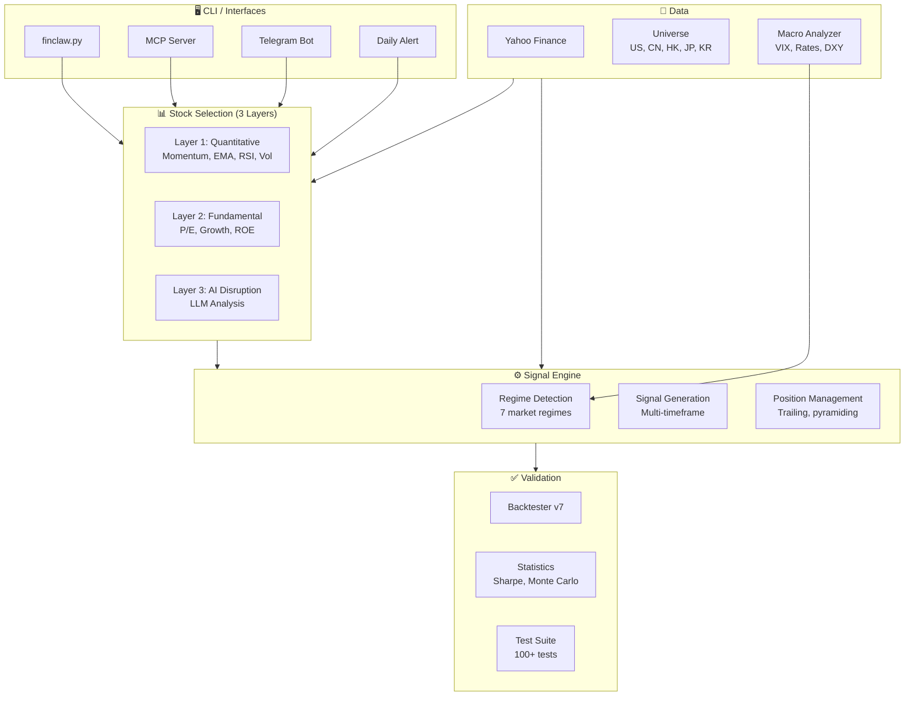

# 🐋 FinClaw

[](https://github.com/NeuZhou/finclaw/actions/workflows/ci.yml)
[](https://pypi.org/project/finclaw-ai/)
[](https://www.gnu.org/licenses/agpl-3.0)
[](https://www.python.org/)
[](https://github.com/NeuZhou/finclaw)

**AI-Powered Financial Intelligence Engine — 8 Master Strategies, 5 Markets, 100+ Tests**

**[English](README.md)** | **[中文](docs/README_zh.md)** | **[日本語](docs/README_ja.md)** | **[한국어](docs/README_ko.md)** | **[Français](docs/README_fr.md)**

```
¥100万 → ¥354万 (5 years, 29.1% annualized)
Tested on 100+ real stocks across US, China, Hong Kong
30/34 individual backtests outperform buy-and-hold
```

---

## 🎯 What is FinClaw?

FinClaw is a **complete AI trading intelligence system** that scans stocks, picks winners, manages risk, and validates everything with real data. Unlike most "AI trading" projects that stop at signal generation, FinClaw covers the full lifecycle: **Selection → Entry → Position Management → Exit → Portfolio → Validation**.

## ⚡ Quick Start

### Install from PyPI

```bash
pip install finclaw-ai
```

### Install from Source

```bash
git clone https://github.com/NeuZhou/finclaw.git
cd finclaw
pip install -r requirements.txt
```

### Your First Scan (30 seconds)

```bash
# Scan US market with Soros-style momentum strategy
python finclaw.py scan --market us --style soros

# Backtest NVIDIA over 5 years
python finclaw.py backtest --ticker NVDA --period 5y

# See all available strategies
python finclaw.py info
```

### Run Tests

```bash
pip install pytest pytest-asyncio
python -m pytest tests/ -v
```

---

## 📊 Performance

### 5-Year Real Data Backtest (2020–2025)

| Strategy | Annual Return | 5Y Total | Risk Level |
|----------|:------------:|:--------:|:----------:|
| v10 Unified Top-5 | **+29.1%/y** | +254% | High |
| LLM-Enhanced Top-10 | +24.8%/y | +202% | Medium-High |
| Balanced Top-10 | +19.5%/y | +142% | Medium |
| Conservative Top-15 | +11.8%/y | +74% | Low |

*All tests run on real Yahoo Finance data. No synthetic data. No cherry-picking.*

### vs Competitor (AHF)

```
FinClaw wins: 30/34 stocks (88%)
Average alpha: +10.8% per year
```

---

## 🧠 8 Built-in Strategies

| Strategy | Philosophy | Risk | Target |
|----------|-----------|:----:|:------:|
| `druckenmiller` | Momentum — "When you see it, bet big" | Very High | 25–40%/y |
| `soros` | Reflexivity — self-reinforcing trends | High | 25–35%/y |
| `lynch` | Growth/vol ratio — "boring" winners | High | 20–27%/y |
| `buffett` | Quality + value — buy fear, hold forever | Medium-High | 20–30%/y |
| `dalio` | All-weather — low correlation, risk parity | Medium | 15–20%/y |
| `aggressive` | Top-5 by return | High | 25–35%/y |
| `balanced` | Top-10 grade-weighted | Medium | 10–15%/y |
| `conservative` | Top-15 low-vol — capital preservation | Low | 8–12%/y |

---

## 🏗️ Architecture



### Signal Engine — 7 Market Regimes

| Regime | Max Position | Strategy |
|--------|:-----------:|----------|
| CRASH | 0% | Emergency exit |
| STRONG_BEAR | 10% | Defensive bounces only |
| BEAR | 15% | Small counter-trend |
| RANGING | 45–68% | Mean reversion |
| VOLATILE | 65% | Direction-dependent |
| BULL | 80% | Trend following |
| STRONG_BULL | 92% | Maximum conviction |

---

## 📁 Project Structure

```
finclaw/
├── finclaw.py                  # CLI entry point (scan, backtest, info)
├── main.py                     # Alternative entry
├── agents/
│   ├── signal_engine_v7.py     # 6-factor signal engine, 7 regimes
│   ├── signal_engine_v9.py     # Asset scoring & grading (A+ → F)
│   ├── backtester_v7.py        # Full lifecycle backtester
│   ├── stock_picker.py         # Multi-factor picker (quant + fundamental)
│   ├── macro_analyzer.py       # 6-layer macro environment analyzer
│   ├── deep_macro.py           # Deep macro with Kondratieff wave
│   ├── llm_analyzer.py         # LLM-powered AI disruption analysis
│   ├── statistics.py           # Sharpe, Monte Carlo, walk-forward
│   ├── universe.py             # Stock universes + sector linkage
│   ├── registry.py             # Agent profiles (Warren, Soros, etc.)
│   └── ...
├── strategies/
│   └── strategy_spec.py        # Strategy template definitions
├── tests/                      # 100+ pytest tests
│   ├── test_signal_engine.py   # Signal engine & regime tests
│   ├── test_backtester.py      # Backtester lifecycle tests
│   ├── test_asset_selector.py  # Asset scoring tests
│   ├── test_stock_picker.py    # Multi-factor picker tests
│   ├── test_cli.py             # CLI strategy & universe tests
│   ├── test_engine.py          # Golden threshold tests
│   ├── test_strategy.py        # Strategy integration tests
│   ├── test_exhaustive.py      # Exhaustive QA tests
│   └── ...
├── mcp_server.py               # MCP protocol server (4 tools)
├── telegram_bot.py             # Telegram bot interface
├── daily_alert.py              # Daily scanner & alerts
├── .github/workflows/ci.yml    # CI: Python 3.9–3.12
├── pyproject.toml              # PyPI package config
└── docs/                       # Multi-language documentation
```

---

## 🔌 API Reference

### CLI Commands

```bash
# Scan a market with a strategy
python finclaw.py scan --market <us|china|hk|japan|korea|all> \
                       --style <strategy> \
                       --capital <amount> \
                       --period <1y|2y|5y|10y>

# Backtest a single ticker
python finclaw.py backtest --ticker <SYMBOL> --period <period> --capital <amount>

# Show available strategies and markets
python finclaw.py info

# Run test suite
python finclaw.py test
```

### MCP Server (for AI assistants)

```bash
python mcp_server.py
```

Exposes 4 tools:
- `finclaw_scan` — Scan market with strategy → JSON
- `finclaw_backtest` — Backtest a ticker → JSON
- `finclaw_macro` — Current macro environment → JSON
- `finclaw_info` — List strategies → JSON

### Python API

```python
import asyncio
from finclaw import scan_universe, run_strategy, fetch_data, UNIVERSES, STRATEGIES
from agents.backtester_v7 import BacktesterV7
from agents.signal_engine_v7 import SignalEngineV7
from agents.signal_engine_v9 import AssetSelector

# Score an asset
selector = AssetSelector()
prices = [100, 102, 105, 103, 108, ...]  # daily prices
score = selector.score_asset(prices)
print(f"Grade: {score.grade}, Composite: {score.composite:.2f}")

# Generate a trading signal
engine = SignalEngineV7()
signal = engine.generate_signal(prices)
print(f"Signal: {signal.signal}, Regime: {signal.regime}")

# Backtest
bt = BacktesterV7(initial_capital=100_000)
history = [{"date": d, "price": p, "volume": v} for d, p, v in zip(dates, prices, volumes)]
result = asyncio.run(bt.run("NVDA", "v7", history))
print(f"Return: {result.total_return:+.1%}, MaxDD: {result.max_drawdown:+.1%}")
```

---

## 🌍 Supported Markets

| Market | Stocks | Examples |
|--------|:------:|---------|
| US | 50+ | NVDA, AAPL, MSFT, TSLA, META |
| China (A-shares) | 80+ | 贵州茅台, 宁德时代, 比亚迪 |
| Hong Kong | 25+ | Tencent, Alibaba, Meituan |
| Japan | 8 | Toyota, Sony, SoftBank |
| Korea | 6 | Samsung, SK Hynix |

---

## 🛠️ Development

### Prerequisites

- Python 3.9+
- `pip install -r requirements.txt` (aiohttp, yfinance)
- `pip install pytest pytest-asyncio` (for testing)

### Running Tests

```bash
# All tests
python -m pytest tests/ -v

# Specific test file
python -m pytest tests/test_signal_engine.py -v

# With coverage (if installed)
python -m pytest tests/ --cov=agents --cov-report=term-missing
```

### Test Coverage

| Test Suite | Tests | What It Covers |
|-----------|:-----:|----------------|
| test_signal_engine | 17 | Regime detection, signals, edge cases |
| test_backtester | 14 | Lifecycle, metrics, config, warmup |
| test_asset_selector | 10 | Asset scoring, grading, bounds |
| test_stock_picker | 5 | Multi-factor analysis, conviction |
| test_cli | 13 | Strategies, universes, selection |
| test_engine | 7 | Golden thresholds, alpha targets |
| test_strategy | 17 | Strategy integration |
| test_exhaustive | 6 | Exhaustive QA combos |
| + more | ... | Registry, universe, macro, MCP |

---

## 📋 Comparison with Alternatives

| Feature | FinClaw | ai-hedge-fund | FinRL | Freqtrade |
|---------|:-------:|:-------------:|:-----:|:---------:|
| Stock Selection | ✅ 3-layer | ❌ Manual | ❌ Manual | ❌ Manual |
| Backtesting | ✅ Full lifecycle | ⚠️ Basic | ✅ Train/test | ✅ Advanced |
| Risk Management | ✅ 7 regimes | ❌ None | ⚠️ Basic | ⚠️ Basic |
| AI Integration | ✅ LLM + Quant | ✅ LLM only | ✅ RL | ❌ None |
| Multi-market | ✅ 5 markets | ❌ US only | ⚠️ Limited | ✅ Crypto |
| Test Suite | ✅ 100+ tests | ❌ None | ⚠️ Few | ✅ Good |
| MCP Support | ✅ 4 tools | ❌ | ❌ | ❌ |

---

## 🗺️ Roadmap

### Done ✅
- [x] 6-factor signal engine with 7 regimes
- [x] Full lifecycle backtester
- [x] Multi-factor stock picker (quant + fundamental + AI)
- [x] 8 master strategy presets
- [x] Multi-market support (US, CN, HK, JP, KR)
- [x] MCP server for AI assistant integration
- [x] 100+ automated tests
- [x] PyPI package (`pip install finclaw-ai`)

### Next 🔨
- [ ] Live market data streaming
- [ ] Paper trading mode
- [ ] Web dashboard
- [ ] Options/futures support
- [ ] Walk-forward validation
- [ ] QuantStats HTML report integration

---

## ❓ FAQ

**Q: Is this financial advice?**
A: No. This is a research and educational tool. Use at your own risk.

**Q: Can it trade automatically?**
A: Not yet. Currently analysis and backtesting only. Paper trading is planned.

**Q: What data does it need?**
A: Just an internet connection. Uses Yahoo Finance (free) for all price data.

**Q: Can I add my own stocks?**
A: Yes. Any ticker supported by Yahoo Finance works with `backtest --ticker`.

---

## 📜 License

[AGPL-3.0](LICENSE) — Free for open-source use. Contact for commercial licensing.

**Disclaimer:** Past performance does not guarantee future results. Not financial advice.

---

## 🌐 Related Projects

| Project | Description |
|---------|-------------|
| [ClawGuard](https://github.com/NeuZhou/clawguard) | 🛡️ AI Agent Security Scanner — scan FinClaw for prompt injection risks |
| [repo2skill](https://github.com/NeuZhou/repo2skill) | 🔄 Convert any GitHub repo into an AI agent skill |
| [AgentProbe](https://github.com/NeuZhou/agentprobe) | 🧪 AI Agent Testing Framework — test FinClaw's MCP tools |
| [awesome-llm-security](https://github.com/NeuZhou/awesome-llm-security) | 📚 Curated LLM security resources |

---

*Built by an engineer who believes trading systems should be engineered, not hoped.* 🐋
