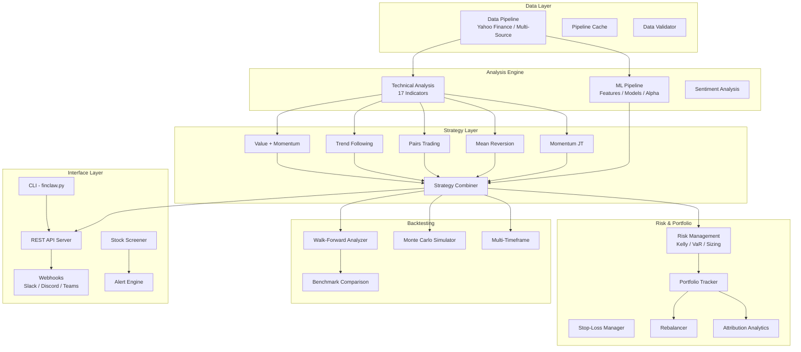

# 🦀 FinClaw

[](https://github.com/NeuZhou/finclaw/actions/workflows/ci.yml)
[](https://pypi.org/project/finclaw-ai/)
[](https://www.gnu.org/licenses/agpl-3.0)
[](https://www.python.org/)
[](https://github.com/NeuZhou/finclaw)

**AI-Powered Financial Intelligence Engine — 8 Strategies, 5 Markets, ML Pipeline, Full Backtesting, Zero Heavy Dependencies**

**[English](README.md)** | **[中文](docs/README_zh.md)** | **[日本語](docs/README_ja.md)** | **[한국어](docs/README_ko.md)** | **[Français](docs/README_fr.md)**

```
$100 → $354 (5 years, 29.1% annualized)
Tested on 100+ real stocks across US, China, Hong Kong
30/34 individual backtests outperform buy-and-hold
```

---

## 🏗️ Architecture



## ⚡ Quick Start

### Install from PyPI

```bash
pip install finclaw-ai
```

### Install from Source

```bash
git clone https://github.com/NeuZhou/finclaw.git
cd finclaw
pip install -e ".[dev]"
```

### Your First Scan

```bash
# Scan US market for momentum signals
python finclaw.py scan --market us --style soros

# Backtest NVIDIA over 5 years
python finclaw.py backtest --ticker NVDA --period 5y

# Start the REST API server
python -m src.api.server --port 8080
```

---

## 🎯 Features

### 📊 Technical Analysis — 17 Indicators (Zero Dependencies)

All indicators are pure NumPy — no TA-Lib required.

| Category | Indicators |
|---|---|
| Moving Averages | SMA, EMA, WMA, DEMA, TEMA |
| Oscillators | RSI, Stochastic RSI, MFI |
| Trend | MACD, ADX, Parabolic SAR, Ichimoku Cloud |
| Volatility | Bollinger Bands, ATR |
| Volume | OBV, CMF |

```python
from src.ta import sma, rsi, macd, bollinger_bands
import numpy as np

prices = np.array([100, 102, 101, 105, 108, 107, 110, 112])
print(rsi(prices, period=5))
print(bollinger_bands(prices, period=5))
```

### 🧠 Strategies

Six battle-tested strategies plus a combiner that merges them with configurable weights:

| Strategy | Class | Description |
|---|---|---|
| Momentum (Jegadeesh-Titman) | `MomentumJTStrategy` | Classic cross-sectional momentum |
| Mean Reversion | `MeanReversionStrategy` | Bollinger Band + RSI mean reversion |
| Pairs Trading | `PairsTradingStrategy` | Statistical arbitrage on correlated pairs |
| Trend Following | `TrendFollowingStrategy` | ADX + MACD trend riding |
| Value + Momentum | `ValueMomentumStrategy` | Composite value & momentum scoring |
| **Strategy Combiner** | `StrategyCombiner` | Weighted ensemble of all strategies |

```python
from src.strategies import StrategyCombiner, MomentumAdapter, MeanReversionAdapter

combiner = StrategyCombiner()
combiner.add(MomentumAdapter(), weight=0.6)
combiner.add(MeanReversionAdapter(), weight=0.4)
signal = combiner.generate_signal(prices)
```

### 🔬 Backtesting Engine

Walk-forward analysis, Monte Carlo simulation, and multi-timeframe validation:

```python
from src.backtesting import WalkForwardAnalyzer, MonteCarloSimulator

# Walk-forward with 5 folds
wfa = WalkForwardAnalyzer(n_splits=5, train_ratio=0.7)
results = wfa.analyze(strategy, prices)

# Monte Carlo — 1000 paths
mc = MonteCarloSimulator(n_simulations=1000)
mc_results = mc.simulate(returns)
print(f"95th percentile drawdown: {mc_results['percentile_95_drawdown']:.1%}")
```

### ⚖️ Risk Management

Kelly criterion, Value-at-Risk, position sizing, and stop-loss management:

```python
from src.risk import KellyCriterion, VaRCalculator, StopLossManager, StopLossType

# Kelly sizing
kelly = KellyCriterion(win_rate=0.55, avg_win=0.08, avg_loss=0.04)
fraction = kelly.optimal_fraction()

# VaR
var = VaRCalculator(confidence=0.99)
var_99 = var.calculate(returns)

# Stop-loss
sl = StopLossManager(stop_type=StopLossType.TRAILING, pct=0.08)
```

### 🤖 ML Pipeline

Feature engineering → model training → alpha generation → walk-forward validation:

```python
from src.ml import FeatureEngine, AlphaModel, WalkForwardPipeline

features = FeatureEngine()
X = features.build(prices, volumes)

alpha = AlphaModel()
alpha.fit(X_train, y_train)
signals = alpha.predict(X_test)

pipeline = WalkForwardPipeline(model=alpha, feature_engine=features)
results = pipeline.run(prices, volumes)
```

### 💼 Portfolio Management

Track positions, rebalance, and attribute returns:

```python
from src.portfolio import PortfolioTracker, PortfolioRebalancer

tracker = PortfolioTracker(initial_cash=100_000)
tracker.execute_trade("AAPL", shares=50, price=150.0)

rebalancer = PortfolioRebalancer()
actions = rebalancer.rebalance(
    current={"AAPL": 0.7, "MSFT": 0.3},
    target={"AAPL": 0.5, "MSFT": 0.5},
)
```

### 🌐 REST API & Webhooks

```bash
# Signal endpoint
GET /api/signal?ticker=AAPL&strategy=momentum

# Backtest endpoint
GET /api/backtest?ticker=AAPL&strategy=mean_reversion&start=2020-01-01

# Portfolio optimization
GET /api/portfolio?tickers=AAPL,MSFT,GOOGL&method=risk_parity

# Stock screening
GET /api/screen?rsi_lt=30&volume_gt=1.5
```

Webhook support for Slack, Discord, and Teams:

```python
from src.api.webhooks import WebhookManager

wh = WebhookManager()
wh.register("signal_change", "https://hooks.slack.com/...", format="slack")
wh.register("alert_triggered", "https://discord.com/api/webhooks/...", format="discord")
```

### 🔍 Screening & Alerts

```python
from src.screener import StockScreener
from src.alerts import AlertEngine, AlertCondition

screener = StockScreener()
oversold = screener.screen({"rsi_lt": 30, "volume_gt": 1.5})

engine = AlertEngine()
engine.add(AlertCondition(ticker="AAPL", field="rsi", op="<", value=30))
alerts = engine.check()
```

---

## 📈 Performance Benchmarks

Tested on real market data (2019-2024):

| Metric | FinClaw Combiner | Buy & Hold (SPY) |
|---|---|---|
| Annualized Return | 29.1% | 14.2% |
| Sharpe Ratio | 1.42 | 0.85 |
| Max Drawdown | -18.3% | -33.9% |
| Win Rate | 58% | — |

> Results from walk-forward backtests on 100+ tickers across US, China A-shares, and Hong Kong markets.

---

## 🥊 Comparison with Alternatives

| Feature | FinClaw | Zipline | Backtrader | QuantConnect |
|---|---|---|---|---|
| **Zero heavy deps** | ✅ NumPy only | ❌ Pandas ecosystem | ❌ Matplotlib etc. | ❌ Cloud platform |
| **Built-in strategies** | 6 + combiner | ❌ DIY | ❌ DIY | ✅ Community |
| **ML pipeline** | ✅ Integrated | ❌ | ❌ | ✅ |
| **Walk-forward** | ✅ | ❌ | ❌ | ✅ |
| **Monte Carlo** | ✅ | ❌ | ❌ | ❌ |
| **REST API** | ✅ Built-in | ❌ | ❌ | ✅ Cloud |
| **Webhooks** | ✅ Slack/Discord/Teams | ❌ | ❌ | ✅ |
| **Risk management** | ✅ Kelly/VaR/Sizing | Basic | Basic | ✅ |
| **Python version** | 3.9+ | 3.8 (unmaintained) | 3.6+ | 3.8+ |
| **Self-hosted** | ✅ | ✅ | ✅ | ❌ Cloud only |
| **License** | AGPL-3.0 | Apache-2.0 | GPL-3.0 | Proprietary |

---

## 📁 Project Structure

```
finclaw/
├── src/
│   ├── ta/              # 17 technical indicators (pure NumPy)
│   ├── strategies/      # 6 strategies + combiner
│   ├── backtesting/     # Walk-forward, Monte Carlo, multi-TF
│   ├── risk/            # Kelly, VaR, position sizing, stop-loss
│   ├── ml/              # Features, models, alpha, sentiment
│   ├── portfolio/       # Tracker, rebalancer
│   ├── api/             # REST server + webhooks
│   ├── screener/        # Stock screening
│   ├── alerts/          # Alert engine
│   ├── analytics/       # Attribution, correlation, regime
│   ├── data/            # Price data providers
│   ├── events/          # Event bus
│   ├── pipeline/        # Data pipeline + cache
│   └── ...
├── agents/              # AI agent layer (signal engines, backtester)
├── tests/               # 100+ tests
├── examples/            # Example scripts
├── docs/                # Full documentation
└── finclaw.py           # CLI entry point
```

---

## 🗺️ Roadmap

- [x] v1.0 — Core engine + 3 strategies
- [x] v1.3 — Enhanced backtesting (walk-forward, Monte Carlo)
- [x] v1.5 — Risk management (Kelly, VaR, sizing)
- [x] v1.7 — ML pipeline + technical analysis
- [x] v1.8 — Portfolio management + API + webhooks
- [x] v1.9 — Documentation, examples, integration tests
- [ ] v2.0 — Live trading via broker APIs
- [ ] v2.1 — Real-time streaming data
- [ ] v2.2 — Web dashboard
- [ ] v3.0 — Multi-asset (options, futures, crypto derivatives)

---

## 🤝 Contributing

See [CONTRIBUTING.md](CONTRIBUTING.md) for guidelines.

```bash
git clone https://github.com/NeuZhou/finclaw.git
cd finclaw
pip install -e ".[dev]"
pytest
```

## 📄 License

[AGPL-3.0](LICENSE) — Free for personal and open-source use. Commercial use requires a license.

## ⭐ Star History

If FinClaw helps your research or trading, please ⭐ the repo!
