[English](README.md) | [日本語](README.ja.md) | [한국어](README.ko.md) | [中文](README.zh-CN.md)

# FinClaw 🦀

**自我进化的交易智能 — 遗传算法(GA)发现你从未想过的策略。**

<p align="center">
  <a href="https://pypi.org/project/finclaw-ai/"></a>
  <a href="https://github.com/NeuZhou/finclaw/actions/workflows/ci.yml"></a>
  <a href="https://opensource.org/licenses/MIT"></a>
  <a href="https://www.python.org/"></a>
  
  
  
  <a href="https://github.com/NeuZhou/finclaw/stargazers"></a>
</p>

> FinClaw 不需要你手写策略——遗传算法(GA)在 484 维因子空间中**自主发现并进化策略**，然后通过 Walk-Forward 验证和蒙特卡洛模拟确认其有效性。

<p align="center">
  
</p>

## 免责声明

本项目**仅供教育和研究使用**，不构成投资建议。过去的表现不代表未来的收益。请务必先进行模拟交易。

---

## 快速开始

```bash
pip install -e .

# 体验全部功能 — 零 API 密钥
finclaw demo

# 下载加密货币行情数据
finclaw download-crypto --coins BTC,ETH,SOL --days 365

# 用遗传算法进化加密货币策略
finclaw evolve --market crypto --generations 50

# 实时行情
finclaw quote BTC/USDT
finclaw quote AAPL
```

就这么简单。无需 API 密钥、交易所账户或配置文件。

### 运行效果

<details>
<summary><code>finclaw demo</code> — 全功能展示</summary>

```
███████╗██╗███╗   ██╗ ██████╗██╗      █████╗ ██╗    ██╗
██╔════╝██║████╗  ██║██╔════╝██║     ██╔══██╗██║    ██║
█████╗  ██║██╔██╗ ██║██║     ██║     ███████║██║ █╗ ██║
██╔══╝  ██║██║╚██╗██║██║     ██║     ██╔══██║██║███╗██║
██║     ██║██║ ╚████║╚██████╗███████╗██║  ██║╚███╔███╔╝
╚═╝     ╚═╝╚═╝  ╚═══╝ ╚═════╝╚══════╝╚═╝  ╚═╝ ╚══╝╚══╝
AI-Powered Financial Intelligence Engine

🎬 FinClaw Demo — All features, zero config

━━━ 📊 Real-Time Quotes ━━━

Symbol        Price     Change        %                 Trend
────────────────────────────────────────────────────────────
AAPL                 189.84    +2.31  +1.23%  ▇█▇▆▅▅▅▄▄▄▃▃▂▁   ▁▁▁
NVDA                 875.28   +15.67  +1.82%  ▄▄▆▅▅▃▂▂  ▂▃▃▁▄▅▆▅▇▆
TSLA                 175.21    -3.45  -1.93%    ▁▁▁▂▄▄▄▄▄▂▃▃▃▄▃▄▅▇
MSFT                 415.50    +1.02  +0.25%  █▇▇▆▄▅▅▅▅▄▅▄▂▂     ▁

━━━ 🚀 Backtest: Momentum Strategy on AAPL ━━━

Strategy:  +75.7%  (+32.5%/yr)    Buy&Hold:  +67.7%
Alpha:     +8.0%                  Sharpe:    1.85
MaxDD:     -8.3%                  Win Rate:  63%

━━━ 🤖 AI Features ━━━

MCP Server  — Expose FinClaw as tools for Claude, Cursor, VS Code
Copilot     — Interactive AI financial assistant
Strategy AI — Natural language → trading code
```

</details>

<details>
<summary><code>finclaw quote BTC/USDT</code> — 实时加密货币行情</summary>

```
BTC/USDT  $68828.00   -3.53%
Bid: 68828.0  Ask: 68828.1  Vol: 455,860,493
```

</details>

<details>
<summary><code>finclaw evolve --market crypto --generations 50</code> — 策略进化</summary>

```
🧬 Evolution Engine — Crypto Market
  Population: 30  |  Mutation Rate: 0.3  |  Elite: 5

  Gen  1 │ Best: 0.342 │ Avg: 0.118 │ Sharpe: 0.89 │ ░░░░░░░░░░
  Gen  5 │ Best: 0.567 │ Avg: 0.234 │ Sharpe: 1.12 │ ██░░░░░░░░
  Gen 10 │ Best: 0.723 │ Avg: 0.389 │ Sharpe: 1.45 │ ████░░░░░░
  Gen 25 │ Best: 0.891 │ Avg: 0.512 │ Sharpe: 1.87 │ ██████░░░░
  Gen 50 │ Best: 0.934 │ Avg: 0.601 │ Sharpe: 2.14 │ ████████░░

  ✅ Best DNA saved to evolution_results/best_gen50.json
```

</details>

---

## 为什么选择 FinClaw？

大多数量化工具需要**你自己**编写策略。FinClaw 替你**进化**策略。

| | FinClaw | Freqtrade | Jesse | FinRL / Qlib |
|---|---|---|---|---|
| 策略设计 | GA 进化 484 维 DNA | 用户编写规则 | 用户编写规则 | 深度强化学习训练智能体 |
| 持续运行 | **策略本身在进化** | 机器人运行，策略固定 | 机器人运行，策略固定 | 训练离线进行 |
| Walk-Forward 验证 | ✅ 内置 (70/30 + 蒙特卡洛) | ❌ 需要插件 | ❌ 需要插件 | ⚠️ 部分支持 |
| 防过拟合 | Arena 竞争 + 偏差检测 | 基础交叉验证 | 基础 | 视工具而定 |
| 零 API 密钥启动 | ✅ `pip install && finclaw demo` | ❌ 需要交易所密钥 | ❌ 需要密钥 | ❌ 需要数据配置 |
| 市场覆盖 | 加密货币 + A 股 + 美股 | 仅加密货币 | 仅加密货币 | A 股 (Qlib) |
| MCP 服务器（AI 代理） | ✅ Claude / Cursor / VS Code | ❌ | ❌ | ❌ |
| 因子库 | 484 个因子，自动加权 | ~50 个手动指标 | 手动指标 | Alpha158 (Qlib) |

### FinClaw 的独特之处

- **自我进化因子** — 遗传算法(GA)在 484 维空间中对策略 DNA 进行突变、交叉与选择。信号权重不由人决定，而由自然选择决定。
- **Walk-Forward 验证** — 每次回测都采用 70/30 训练/测试拆分和蒙特卡洛模拟（1,000 次迭代，p < 0.05）。这是机构投资者级别的验证方法，而非简单的样本内回测。
- **多市场覆盖** — 加密货币（通过 ccxt 支持 100+ 交易所）、A 股（AKShare + BaoStock）、美股（Yahoo Finance）。一个引擎，覆盖全市场。
- **AI 原生** — 内置 MCP 服务器，Claude、Cursor、VS Code 可以原生调用 FinClaw 进行行情查询、回测执行和投资组合分析。

---

## 架构

```
┌──────────────────────────────────────────────────────┐
│             进化引擎（核心）                            │
│      遗传算法 → 突变 → 回测 → 选择                     │
│                                                       │
│      输入: 484 因子 × 权重 = DNA                       │
│      输出: Walk-Forward 验证后的策略                    │
├──────────────────────────────────────────────────────┤
│                 因子来源                               │
│   ┌──────────┐ ┌──────────┐ ┌──────────┐ ┌────────┐ │
│   │  技术面   │ │  情绪面   │ │   DRL    │ │ Davis  │ │
│   │  284     │ │  新闻    │ │Q-learning│ │Double  │ │
│   │  通用    │ │  EN / ZH │ │  信号    │ │ Play   │ │
│   └────┬─────┘ └────┬─────┘ └────┬─────┘ └───┬────┘ │
│        └─────────────┴────────────┴────────────┘      │
│   + 200 个加密货币专用因子                               │
│                全部 → compute() → [0, 1]               │
├──────────────────────────────────────────────────────┤
│               质量保障                                  │
│   ┌────────────┐ ┌─────────────┐ ┌────────────────┐  │
│   │   Arena    │ │    偏差     │ │  Walk-Forward  │  │
│   │   竞争     │ │    检测     │ │  + 蒙特卡洛     │  │
│   └────────────┘ └─────────────┘ └────────────────┘  │
├──────────────────────────────────────────────────────┤
│               执行层                                    │
│   模拟交易 → 实盘交易 → 100+ 交易所                      │
└──────────────────────────────────────────────────────┘
```

---

## 因子库（484 个因子）

284 个通用因子 + 200 个加密货币专用因子，按类别组织：

| 类别 | 数量 | 示例 |
|----------|-------|---------|
| 加密货币专用 | 200 | 资金费率代理、时段效应、巨鲸检测、连环清算 |
| 动量 | 14 | ROC、加速度、趋势强度、质量动量 |
| 成交量与资金流 | 13 | OBV、聪明资金、量价背离、Wyckoff VSA |
| 波动率 | 13 | ATR、布林带收窄、状态切换检测、波动率的波动率 |
| 均值回归 | 12 | Z 分数、橡皮筋、凯尔特纳通道位置 |
| 趋势跟踪 | 14 | ADX、EMA 金叉、高点抬高/低点抬高、均线扇形 |
| Qlib Alpha158 | 11 | KMID、KSFT、CNTD、CORD、SUMP（兼容微软 Qlib） |
| 质量过滤 | 11 | 盈利动量代理、相对强度、韧性指标 |
| 风险预警 | 11 | 连续亏损、死叉、跳空下跌、跌停 |
| 逃顶指标 | 10 | 筹码派发检测、放量见顶、聪明资金退出 |
| 价格结构 | 10 | K 线形态、支撑/阻力、枢轴点 |
| Davis Double Play | 8 | 营收加速、技术护城河、供给枯竭 |
| Alpha | 10 | 多种 Alpha 因子实现 |
| 缺口分析 | 8 | 缺口回补、缺口动量、缺口反转 |
| 市场宽度 | 5 | 涨跌指标、板块轮动、新高/新低 |
| 新闻情绪 | 2 | 中英文关键词情绪评分 + 动量 |
| DRL 信号 | 2 | Q-learning 买入概率 + 状态价值估计 |
| ……更多 | 130 | 基本面代理、回撤确认、底部确认、状态切换等 |

> **设计理念**：技术面、情绪面、DRL、基本面——所有信号统一表示为返回 `[0, 1]` 的因子。权重由进化引擎决定，信号合成中不引入人为偏差。

---

## 进化引擎

遗传算法(GA)持续发现最优策略：

1. **播种** — 以多样化的因子权重配置初始化种群
2. **评估** — 用 Walk-Forward 验证对每条 DNA 进行回测
3. **选择** — 保留表现最优者
4. **变异** — 随机权重扰动、交叉、因子增删
5. **循环** — 在你的机器上 7×24 小时运行

```bash
# 加密货币（主要用例）
finclaw evolve --market crypto --generations 50

# A 股
finclaw evolve --market cn --generations 50

# 自定义参数
finclaw evolve --market crypto --population 50 --mutation-rate 0.2 --elite 10
```

### 进化结果

| 市场 | 代数 | 年化收益率 | 夏普比率 | 最大回撤 |
|--------|-----------|---------------|--------|-------------|
| A 股 | 第 89 代 | 2,756% | 6.56 | 26.5% |
| 加密货币 | 第 19 代 | 16,066% | 12.19 | 7.2% |

> ⚠️ **以上为历史数据的样本内回测结果**。实际表现会显著低于上述数据。Walk-Forward 样本外验证已默认开启——在信任任何进化策略之前，请务必检查 OOS 指标。使用 `finclaw check-backtest` 验证结果，并在投入真金白银之前用 `finclaw paper` 进行模拟交易。

---

## Arena 模式（防过拟合）

传统回测独立评估每条策略——过拟合的策略在历史数据上表现优异，实盘却一塌糊涂。FinClaw 的 **Arena 模式**解决了这个问题：

```
┌──────────────────────────────────────────┐
│         Arena：共享市场模拟                  │
│                                           │
│   DNA-1 ──┐                              │
│   DNA-2 ──┤── 同一 OHLCV 数据              │
│   DNA-3 ──┤── 同一初始资金                  │
│   DNA-4 ──┤── 拥挤时产生价格冲击             │
│   DNA-5 ──┘── 按最终盈亏排名                │
│                                           │
│   过拟合 DNA → 排名靠后 → 受到惩罚           │
└──────────────────────────────────────────┘
```

- 多条 DNA 策略在同一模拟市场中同步交易
- **拥挤惩罚**：当超过 50% 的 DNA 策略在同一信号上买入时，触发价格冲击
- 只能在隔离环境下奏效的过拟合策略在 Arena 排名中遭到惩罚

---

## 偏差检测

在信任结果之前，检测回测中的常见陷阱：

```bash
python -m src.evolution.bias_cli --all
```

| 检查项 | 检测内容 |
|-------|----------------|
| **前视偏差** | 意外引用了未来数据的因子 |
| **数据窥探** | 训练集表现超测试集 3 倍以上的 DNA（过拟合） |
| **幸存者偏差** | 回测期间已退市的资产 |

---

## CLI 参考

FinClaw 提供 70+ 子命令，以下是常用的核心命令：

```bash
# 行情与数据
finclaw quote AAPL              # 美股行情
finclaw quote BTC/USDT          # 加密货币行情（通过 ccxt）
finclaw history NVDA            # 历史数据
finclaw download-crypto         # 下载加密货币 OHLCV 数据
finclaw exchanges list          # 查看支持的交易所

# 进化与回测
finclaw evolve --market crypto  # 运行遗传算法进化
finclaw backtest -t AAPL        # 对个股进行策略回测
finclaw check-backtest          # 验证回测结果

# 分析与工具
finclaw analyze TSLA            # 技术分析
finclaw screen                  # 选股筛选
finclaw risk-report             # 投资组合风险报告
finclaw sentiment               # 市场情绪
finclaw demo                    # 全功能演示
finclaw doctor                  # 环境检查

# AI 功能
finclaw copilot                 # AI 金融助手
finclaw generate-strategy       # 自然语言 → 策略代码
finclaw mcp serve               # AI 代理 MCP 服务器

# 模拟交易
finclaw paper                   # 模拟交易模式
finclaw paper-report            # 模拟交易报告
```

完整命令列表请运行 `finclaw --help`。

---

## MCP 服务器（AI 代理专用）

将 FinClaw 作为工具暴露给 Claude、Cursor、VS Code 或任何兼容 MCP 的客户端：

```json
{
  "mcpServers": {
    "finclaw": {
      "command": "finclaw",
      "args": ["mcp", "serve"]
    }
  }
}
```

提供 10 个工具：`get_quote`、`get_history`、`list_exchanges`、`run_backtest`、`analyze_portfolio`、`get_indicators`、`screen_stocks`、`get_sentiment`、`compare_strategies`、`get_funding_rates`。

---

## 数据来源

| 市场 | 数据源 | 是否需要 API 密钥？ |
|--------|--------|-----------------|
| 加密货币 | ccxt（100+ 交易所） | 不需要（公开数据） |
| 美股 | Yahoo Finance | 不需要 |
| A 股 | AKShare + BaoStock | 不需要 |
| 新闻情绪 | CryptoCompare + AKShare | 不需要 |

---

## 仪表盘

```bash
cd dashboard && npm install && npm run dev
# 打开 http://localhost:3000
```

- 实时价格（加密货币、美股、A 股）
- TradingView 专业图表
- 实时盈亏投资组合追踪
- 带筛选器 + CSV 导出的选股器
- AI 聊天助手（OpenAI、Anthropic、DeepSeek、Ollama）

---

## 验证与质量保障

- Walk-Forward 验证（70/30 训练/测试拆分）
- 蒙特卡洛模拟（1,000 次迭代，p 值 < 0.05）
- Bootstrap 95% 置信区间
- Arena 竞争（多 DNA 市场模拟）
- 偏差检测（前视、窥探、幸存者）
- 因子 IC/IR 分析与衰减曲线
- 因子正交矩阵（自动剔除冗余因子）
- 适应度函数中的换手率惩罚
- 5,600+ 自动化测试

---

## 路线图

- [x] 484 因子进化引擎
- [x] Walk-Forward 验证 + 蒙特卡洛
- [x] Arena 竞争模式
- [x] 偏差检测套件
- [x] 新闻情绪 + DRL 因子
- [x] Davis Double Play 因子
- [x] 模拟交易基础设施
- [x] AI 代理 MCP 服务器
- [ ] DEX 执行（Uniswap V3 / Arbitrum）
- [ ] 多时间框架支持（1h/4h/1d）
- [ ] 价格序列 Foundation 模型

---

## 🌐 生态系统

FinClaw 是 NeuZhou AI 代理工具集的一部分：

| 项目 | 描述 |
|---------|-------------|
| **[FinClaw](https://github.com/NeuZhou/finclaw)** | AI 原生量化金融引擎 |
| **[ClawGuard](https://github.com/NeuZhou/clawguard)** | AI 代理免疫系统 — 285+ 威胁模式，零依赖 |
| **[AgentProbe](https://github.com/NeuZhou/agentprobe)** | AI 代理的 Playwright — 测试、录制、回放代理行为 |

---

## 参与贡献

```bash
git clone https://github.com/NeuZhou/finclaw.git
cd finclaw && pip install -e ".[dev]"
pytest
```

欢迎贡献！请参阅 [CONTRIBUTING.md](CONTRIBUTING.md) 了解贡献指南。

**贡献方式：**
- 🐛 [提交 Bug](https://github.com/NeuZhou/finclaw/issues)
- 💡 [提出功能建议](https://github.com/NeuZhou/finclaw/issues)
- 🔧 提交 Pull Request
- 📝 改进文档
- ⭐ 觉得有用就点个 Star 吧

---

## 局限性

FinClaw 是研究和教育工具，存在以下局限：

- **免费数据源** — 可能存在延迟、缺失和 API 频率限制
- **简化的回测** — 未建模挂单簿深度、部分成交和市场微观结构
- **样本内偏差** — 进化出的策略未必在样本外同样有效，务必检查 Walk-Forward OOS 结果
- **先模拟再实战** — 投入真金白银之前，务必用模拟交易验证策略

生产级交易请配合完善的风险管理和仓位控制。

---

## 开源许可

[MIT](LICENSE)

---

## Star History

<a href="https://www.star-history.com/#NeuZhou/finclaw&Date">
  <picture>
    <source media="(prefers-color-scheme: dark)" srcset="https://api.star-history.com/svg?repos=NeuZhou/finclaw&type=Date&theme=dark" />
    
  </picture>
</a>
