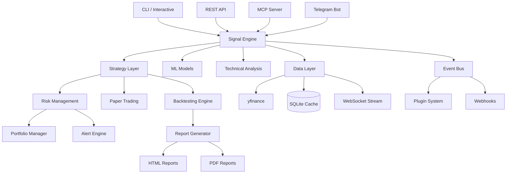
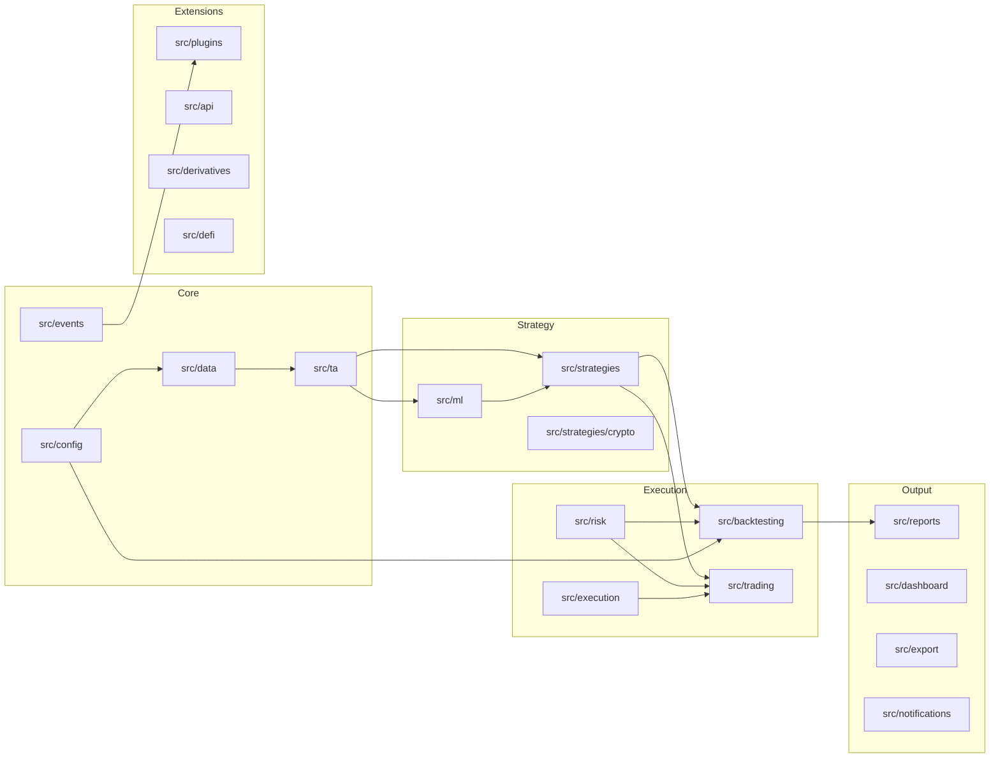
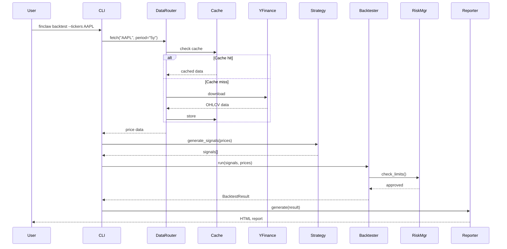
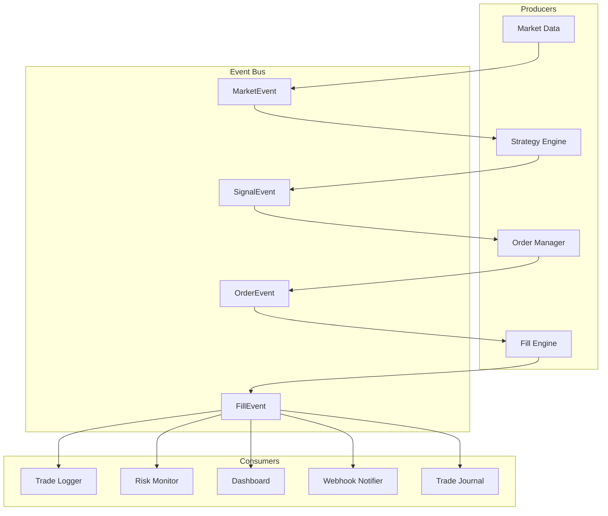
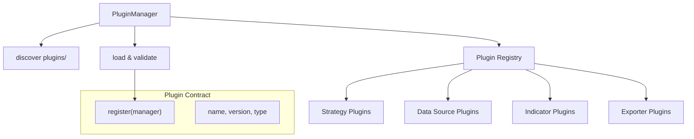

# FinClaw Architecture

> System architecture for FinClaw v3.7.0

## High-Level Overview



## Module Dependency Graph



## Data Flow



## Event System

FinClaw uses a publish/subscribe event bus for decoupled communication.



### Event Types

| Event | Payload | Emitted By |
|-------|---------|------------|
| `MarketEvent` | OHLCV bar | Data layer |
| `SignalEvent` | ticker, action, confidence | Strategy |
| `OrderEvent` | ticker, side, quantity, type | Order router |
| `FillEvent` | ticker, price, quantity, commission | Execution |

## Plugin Architecture



### Plugin Types

| Type | Interface | Example |
|------|-----------|---------|
| `strategy` | `generate_signal(prices) → str` | Custom momentum variant |
| `data_source` | `fetch(ticker, period) → DataFrame` | Alternative data provider |
| `indicator` | `calculate(data) → Array` | Custom TA indicator |
| `exporter` | `export(result) → None` | CSV/Parquet exporter |

### Writing a Plugin

```python
# plugins/my_plugin.py

def register(manager):
    """Called by PluginManager on load."""
    manager.add_strategy("my_strategy", MyStrategy)
    manager.add_indicator("my_indicator", my_indicator_fn)
```

## Directory Structure

```
finclaw/
├── src/
│   ├── ta/              # Technical analysis (17 indicators)
│   ├── strategies/      # Trading strategies (9 strategies)
│   ├── ml/              # Machine learning models
│   ├── backtesting/     # Backtesting engines
│   ├── risk/            # Risk management
│   ├── data/            # Data fetching & caching
│   ├── events/          # Event bus (pub/sub)
│   ├── plugins/         # Plugin system
│   ├── analytics/       # Performance analytics
│   ├── portfolio/       # Portfolio tracking
│   ├── reports/         # Report generation
│   ├── dashboard/       # Interactive dashboards
│   ├── api/             # REST API + webhooks
│   ├── execution/       # Order routing
│   ├── trading/         # Paper trading
│   ├── derivatives/     # Options pricing
│   ├── crypto/          # On-chain analytics
│   ├── defi/            # DeFi yield tracking
│   ├── screener/        # Stock screener
│   ├── alerts/          # Alert engine
│   ├── notifications/   # Webhook notifications
│   ├── export/          # Data export
│   ├── sandbox/         # Strategy sandbox
│   ├── simulation/      # Scenario simulation
│   ├── journal/         # Trade journal
│   ├── watchlist/       # Watchlist manager
│   ├── fixed_income/    # Yield curve
│   ├── cli.py           # CLI entry point
│   ├── config.py        # Configuration
│   └── interactive.py   # Interactive mode
├── agents/              # AI agents (signal engine, backtester, LLM)
├── strategies/          # Strategy YAML specs
├── tests/               # 800+ pytest tests
├── docs/                # Documentation
├── finclaw.py           # Main entry point
└── pyproject.toml       # Package config
```

## Key Design Decisions

1. **Pure NumPy TA** — Zero dependency on TA-Lib; all indicators implemented in pure Python + NumPy for portability.

2. **Event-Driven Backtesting** — v3.6 added a full event-driven backtester alongside the vectorized one, enabling realistic order flow simulation.

3. **Plugin System** — Extensible via `register(manager)` pattern. Supports 4 plugin types without modifying core code.

4. **Layered Risk** — Position-level (stop-loss), strategy-level (Kelly), and portfolio-level (concentration limits, drawdown circuit breakers) risk management.

5. **Cache-First Data** — SQLite cache with configurable TTL reduces API calls and enables offline development.

6. **AGPL License** — Open source with copyleft to ensure community contributions flow back.
